# GenericMessage

# Background

UE provides built-in Delegates for message handling:

````C++
DECLARE_DELEGATE_OneParam(FDelegateTypeName, Type)
DECLARE_DELEGATE_TwoParams(FDelegateTypeName, Type1, Type2)
...
```

```C++
DECLARE_MULTICAST_DELEGATE_OneParam(FDelegateTypeName, Type)
DECLARE_MULTICAST_DELEGATE_TwoParams(FDelegateTypeName, Type1, Type2)
...
````

However, these require forward declarations and dependencies on specific header files. For cross-module collaboration, additional shared dependencies are needed.

Common Message Dispatching and Handling:

```C++
#include "XXXDelegates.h"

FWorldDelegates::OnWorldXXX().Broadcast(...);
````

```C++
#include "XXXDelegates.h"

FWorldDelegates::OnWorldXXX().AddWeakLambda(this, [this](...){...});
```

Challenges
Maintaining a shared header file requires frequent modifications, leading to widespread code recompilation.

To expose events to Blueprints or other scripting languages, you must use Dynamic Delegates:


```C++
DECLARE_DYNAMIC_DELEGATE_OneParam(FDelegateTypeName, Type, Name)
DECLARE_DYNAMIC_DELEGATE_TwoParams(FDelegateTypeName, Type1, Name1, Type2, Name2)
...
```

Dynamic Delegates are not very C++-friendly.
Binding member functions requires UFUNCTION, which must be declared in the class definition, causing additional complexity.


**Is there a way to reduce dependencies while supporting both C++ and Blueprint scripting languages?**

# Using GMP (Generic Message Plugin)

First, integrate the GMP plugin:，[Github](https://github.com/wangjieest/GenericMessagePlugin) ，[Unreal Marketplace](https://www.unrealengine.com/marketplace/en-US/product/genericmessageplugin-gmp)

Inspired by GameplayTags and RPC, GMP leverages UE Editor workflows to provide a more efficient messaging system.

**Send and Receive Messages with a Single Line of Code!**

Broadcasting a Message

```C++
// Message communication based on name constraints, with optional runtime checks  
FGMPHelper::SendMessage(MSGKEY("World.Hello"), Param1, Param2, Param3);
```

Listening for a Message

```C++
// "One-line" callback registration 
FGMPHelper::ListenMesage(MSGKEY("World.Hello"), this, [this] (Type1 P1, Type2 P2 ){
    ...
});

```


Blueprint Integration
Easily use GMP in Blueprints.
In NotifyMessage or ListenMessage nodes, select the desired GameplayTag from the dropdown menu.
The Blueprint nodes will automatically generate the necessary pins.


Adding Blueprint Events


Debugging Event Graphs
While debugging an EventGraph, the Blueprint node displays:
Listening objects for the current event.
Historical records of triggered events based on the selected GameplayTag Key.


## For more details
## UE-GMP (GenericMessagePlugin) Principle

### Start with object-oriented

Alan Kay, the father of OO language, the inventor of Smalltalk, said this when talking about OOP:

> I thought of objects being like biological cells and/or individual computers on a network, only able to communicate with messages (so messaging came at the very beginning -- it took a while to see how to do messaging in a programming language efficiently enough to be useful)....
>
> OOP to me means only messaging, local retention and protection and hiding of state-process, and extreme late-binding of all things. It can be done in Smalltalk and in LISP.

In short, delivering messages and how to deliver messages.

#### sequence

In all object-oriented programs, we have the following form

```C++
Object->Func(Parameters); 
```

> Object + Method + Parameter --> Pass a message to a specific object

Dig deeper into this, when you cannot know a specific object, it is simplified to inform specific data at a specific opportunity.

Instead of directly getting the object object, you get the Delegate object

```C++
Delegate.Broadcast(Parameters);
```

> Delegate + Signature + Parameters --> Pass messages to indefinite objects

For the language level, it is necessary to be asynchronous. Erlang copied a copy of the data and distributed it for each actor to process the message.

For languages that perform synchronization processing, we use delegate to describe it,

```C++
TDelegate<R(Args...)> 
TMulticastDelegate<...>
```

UnrealEngine itself provides a series of Delegate components, which generally seem to be enough for use.

#### but

1. Based on the verification of static signatures, we have to maintain a common header file. The more compilation units that rely on this header file during use, modifying and updating the header file will gradually lead to a larger range of code compilation.
2. It should be said that most projects are gradually developing using plug-in functions, with more and more modules, and dependencies becoming more and more difficult to organize.
3. Considering that Blueprint is another set of Interface and Dispatcher mechanisms, we have to design and process casebycase.

So, is there a solution that can solve the above problems and ensure correctness?

#### Original intention

The original intention of GMP is to strive to solve the above problems.

After some exploration, static characters are used here for constraints:

By relying on static strings, we can avoid introducing common header files, remaining signature matching, borrowing from UE's workflow, and introducing some additional verification mechanisms to maintain signature consistency.

If strict verification is required, GMP provides independent compile-time inspection tools to perform integrity verification.Implement independent blueprint nodes, and automatically bring signature information when reflected to the blueprint when used.

Here are two simple APIs that can directly compare the UE's

```C++
Delegate function.template<typename... TArgs> 
static auto NotifyMessage(const FMSGKEYFind& K, TArgs&&... Args);
````

```C++
template<typename T, typename F> 
static FGMPKey ListenMessage(const MSGKEY_TYPE& K, T* Listenner, F&& f);
```

```C++
FGMPHelper::NotifyMessage(MSGKEY("Common.Action"), Param1, Param2); 
FGMPHelper::ListenMessage(MSGKEY("Common.Action"), this, [this](Type1& Param1, Type2& Param2){
    // ... 
});
```

For signature management, we will learn from the functions of GameplayTags to implement the two modules of UncookOnly MessageTags (Editor), including a series of capabilities such as collection, management, retrieval, and verification.

This further improves the interaction of Blueprint nodes.

The constraints of MSGKEY based on strings, using GMP for cross-module decoupling **can directly remove modules without any compilation problems**.

Many subsequent improvements and features are in-depth and sublimated based on the above design.

### Object-level message

Return to the previous support of "passing messages to specific objects" to increase the ability to target specific objects for GMP in broadcast form.The interface is as follows

```C++
template<typename... TArgs> 
static auto NotifyObjectMessage(const UObject* Obj, const FMSGKEYFind& K, TArgs&&... Args);
```
```C++
template<typename T, typename F> 
static FGMPKey ListenObjectMessage(const UObject* Obj, const MSGKEY_TYPE& K, T* Listenner, F&& f);
```

A parameter Obj is added to the interface, which is filtered for specific Obj. It can be simply understood that it is a query for double KEY.

However, it is not so easy for many people to understand this concept, especially the functions introduced later are also integrated.

Here is a detailed description of pseudo-codeFirst of all, it is a basic understanding, put Obj on the first parameter of the variable parameter to implement simple filtering:

```C++
// NotifyObjectMessage --> 
FGMPHelper::NotifyMessage(MSGKEY("Common.Action"), Obj, Param1, Param2);
```

```C++
// ListenObjectMessage --> 
FGMPHelper::ListenMessage(MSGKEY("Common.Action"), this, [this, Obj](UObject* InObj, Type1& Param1, Type2& Param2){
        if(InObj != Obj) return;     
        // ... 
    });
```

Of course, there are some considerations in the final implementation.Here we continue to introduce two other APIs for GMP:

### NotifyWorldMessage/ListenWorldMessage

World context, mainly used to distinguish in the presence of PIE multiple Worlds (if there are no multiple Worlds in the same process, you can ignore it).

```C++
template<typename... TArgs> 
static auto NotifyWorldMessage(const UObject* WorldContextObj, const FMSGKEYFind& K, TArgs&&... Args);
```

```C++
template<typename T, typename F> 
static FGMPKey ListenWorldMessage(const UObject* WorldContextObj, const MSGKEY_TYPE& K, T* Listenner, F&& f);
```

Next, the combination based on the above APIs is a bit brain-burning.

### Simple mapping

NotifyMessage -- ListenMessage Directly corresponds to

NotifyObjectMessage -- ListenObjectMessage can correspond to the same Object

NotifyWorldMessage -- ListenWorldMessage The same World (WorldCtxObj->GetWorld()) can correspond to

### Mapping with hierarchical relationships

In fact, messages at a smaller level will be passed on to a larger level of listening.

NotifyObjectMessage --> NotifyWorldMessage --> NotifyMessage

Under this design, the role of NotifyObjectMessage is gradually reflected.

Where all Notify we can specify the context object with a minimum level of granularityThen the listener can selectively monitor and filter according to the hierarchy relationshipGoing back to the sentence "passing messages to specific objects", GMP not only implements the ability to message specific objects, but also performs an effective extension based on the characteristics of UnrealEngine itself.

"ObjectMessage" will be further expanded in the futures

#### About binding callbacks

In the initial version of GMP, Listenner only supports UObject, because the judgment of message distribution is to use it.

```C++
!FWeakObjectPtr::IsStale(true)
```

To judge.

Here you can also see the judgment of GetWorld, which is used to use the message level of the above WorldMessage.

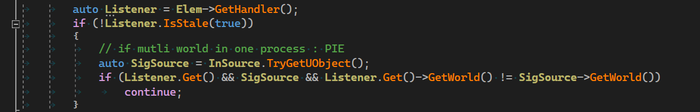

### WeakLambda

UE4.20 adds WeakLambda support, Delegate has corresponding member functions: BindWindLambda/CreateWeakLambda

GMP supports global function CreateWeakLambda in earlier versions, making the code writing concise and unified. CreateWeakLambda not only supports UObject, but also supports smart pointers, CreateSPLambda, and CreateAttribute series.

The ListenMessage of GMP unifies the relevant parameters here, and is unified into the last two parameters.

```C++
T* Listenner, F&& f
```

Supports both binding member functions and WeakLambda modethis,

```C++
[this]{ xxxxxx }
```

I personally think this method is really silky

### MSGKEY/FMSGKEY_Find/MSGKEY_TYPE

Going back to the string convention mentioned above, in order to automatically collect and analyze signature information, we need to force the use of string literals, corresponding to GMP's regular API interface parameter MSGKEY("XXXX") .

When searching for code, MSGKEY can also facilitate global search. In addition, GMP has made a supporting vsix plug-in and can query and jump the same MSGKEY like Tomato.

Furthermore, with this layer of MSGKEY, the clang ast plug-in can be used for type checking during compilation period, but it seems that it does not need to be used in general use. This method should be used to fully check all signature matching during CI.For blueprint support, GMP provides a series of interfaces starting with Script. Since the blueprint node itself has a compilation check function, the inspection work is placed in the blueprint compilation process in the uncook stage, so that the skills ensure correctness. The relevant functions have been solidified under the runtime of the blueprint node and no additional information is required.For support for other scripts, GMPMeta collects edited signature information and saves it to a configuration file.

### GMPMeta

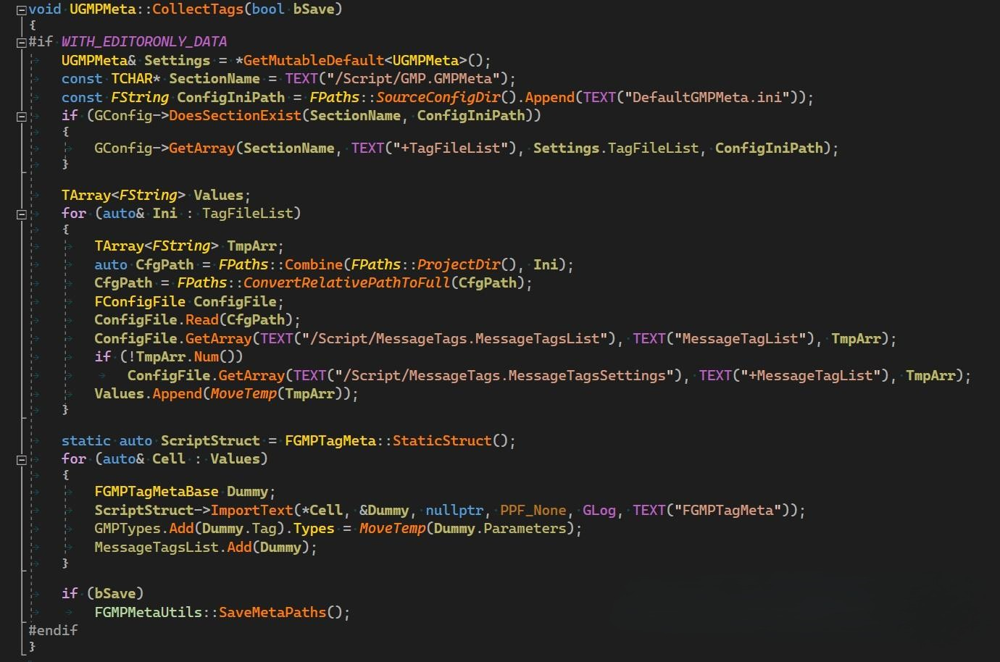

If necessary, you can configure DefaultGMPMeta.ini in Staging to bring it to the release pak, which is mainly used to verify the problem of type mismatch during the use of script interfaces.

### Class2Name

When we use the message interface,

```C++
// NotifyObjectMessage --> 
FGMPHelper::NotifyMessage(MSGKEY("Common.Action"), Param1, Param2);

// ListenObjectMessage --> 
FGMPHelper::ListenMessage(MSGKEY("Common.Action"), this, [this, Obj](Type1& Param1, Type2& Param2){
    if(InObj != Obj) return;
    // ... 
    });
```

GMP generates signature information associated with MSGKEY based on UE reflection and C++ template characteristics.The signature information contains a set of parameter type strings, based on the Class2Name capability:

Given a parameter type, through TClass2Name, we can get the string that matches it.

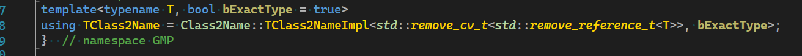

GMP can automatically obtain the name corresponding to the type supported by the Blueprint.

The code call process in the Editor state will automatically record this information in the ini configuration file.


During the call process, MSGKEY will be associated and judged with its corresponding parameter list. If it does not match the type of history, it will be warned and returned. If it is compatible, the configuration corresponding to ini will be updated.

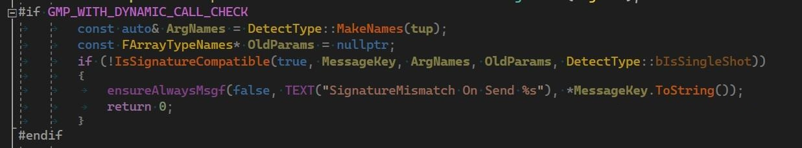

#### Message parameter compatibility

If the list is compatible, the parameter type list corresponding to MSGKEY is updated.

The compatibility processing here is similar to the default parameters of the function, and the function call can omit parameters from behind to front.

#### GMP means that the receiver can omit parameters from behind to front

For example, a message is sent

```C++
SendMessage(MSGKEY("ABC"), a, b, c);
```

Then the following methods are compatible

```C++
ListenMessage(MSGKEY("ABC"), this, [this](TypeA a, TypeB b, TypeC c){}); 
ListenMessage(MSGKEY("ABC"), this, [this](TypeA a, TypeB b){}); 
ListenMessage(MSGKEY("ABC"), this, [this](TypeA a){}); 
ListenMessage(MSGKEY("ABC"), this, [this](){});
```

The specific usage scenario is similar to the default parameters of the function. We can add parameters to the end of the existing message without affecting the previous listening code.

### Class2Prop

The advancement of Class2Name, due to some situations (such as insufficient meta information when interacting with other scripts), you need to get its corresponding FProperty* and then further transform the parameters, etc.

This function can be used separately and is more useful to people who write library and support functions.

For example, when writing RPC and serialization functions, it can save a lot of workload.

### FMessageBody

The local message is passed, maintaining the context of the call, and is used to unify the call and callback of the message.

Here is a brute-force type erasing method: -> void* ->uint64

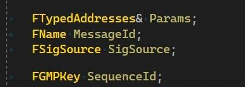

SigSource records the above specific objects.

MessageId The MSGKEY used by record

The Params type is TArray `<FGMPTypedAddr>`,

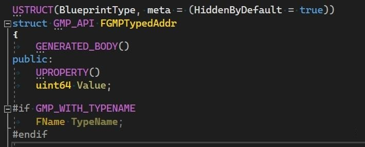

Used to erase a single parameter type as parameter address: uint64, and type information when necessary: FName

#### The specific generation process has actually been encapsulated in the API

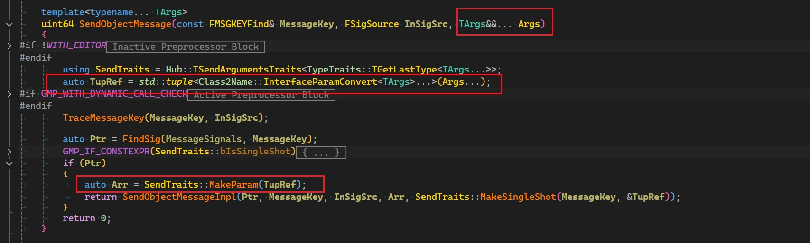

### FSigSource

When talking about the Object of SendObjectMessage before, here is the scope of extending this Object.

This is a significant improvement: we can distribute messages for any address, especially custom data.

Since messages can be distributed for a UObject object, why can't it be distributed for a memory address? The essential matching process is the same.

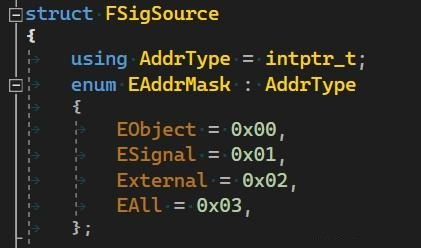

So we modify the Object to FSigSource and expand it.

EObject is still the logic of the original Object.As an automated extension,

ESignal only needs to inherit ISigSource, use destructors, and automatically maintain the life cycle.

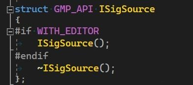

External supports manual management of life cycles. When the object is destroyed, the cleaning function needs to be called manually.


In Puerts support, this method is used for Isolate.In this way, the interface has also been expanded

```C++
template<typename... TArgs> 
static auto NotifyObjectMessage(FSigSource SigSource, const FMSGKEYFind& K, TArgs&&... Args);
```

```C++
template<typename T, typename F> 
static FGMPKey ListenObjectMessage(FSigSource SigSource, const MSGKEY_TYPE& K, T* Listenner, F&& f);
```

### RequestRespone

For some requests, they are asked and answered, and the logic is asynchronous. The functions described above in GMP require two MSGKEYs to be returned and returned, which is relatively split.

GMP supports the Request/Respone capabilities here.

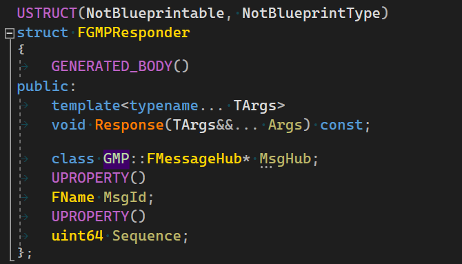

For SendMessasge, we allow the last parameter to be a callback object (similar to ListenMessage) to handle OnRespone messages.

For ListenMessage, we allow the last parameter to be a GMPResponder, and then hold the object, and use Response to perform the package back after the asynchronous process is processed.

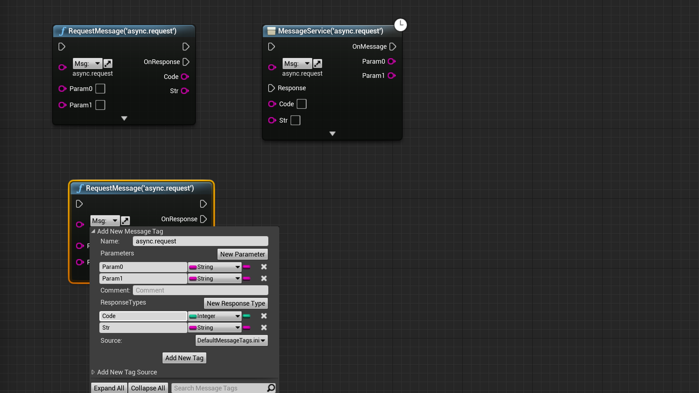

### TGMPNativeInterface

Supports Native interface-based message interaction

### FGMPKey/Times/Order

Listen provides Options parameters, and supports Times and Order.

Times: The number of listening times is limited. When Times>=0, the callback reaches a certain specified number of times automatically Unlisten.

Order: For the same listening source and different callback objects, sometimes you need to specify the order by yourself. The smaller the callback, the first callback will be called first. The same is true.

### HTTPRequest

With the help of extended Json serialization support, based on NeuronAction, we can easily encapsulate simple and easy-to-use functions.

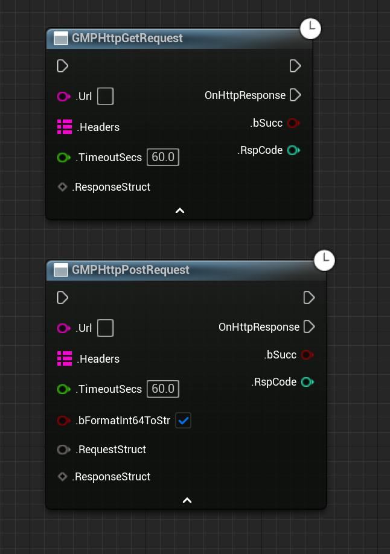

### TGMPFunction

The function implemented by minimalist type erase, supports custom inherent data segments

### SendMessages

### GMPStructUnion

### GMPArchive

### RPC

### NeuronAction

### NeuronNode

### PuertsSupport


