# GMP · GenericMessagePlugin

[English](README.md) | **简体中文**

**一套消息，喂饱 C++、蓝图和五种脚本。**

发和收之间没有共享的类型头，只有一个字符串约定 —— 所以你能直接把一个模块删掉，不会有编译错误在等你。

[Unreal Marketplace](https://www.unrealengine.com/marketplace/en-US/product/genericmessageplugin-gmp) · [旧版 README 存档](README_old.md) · [派发栈深度实测](docs/dispatch-stack-measured.md)

---

## 为什么

用原生 Delegate 做模块间通信，早晚会遇到三件事：

- 静态签名要共享头文件，依赖它的 TU 越多，改一次编译一大片
- 项目越插件化，模块依赖图越难理
- 蓝图那边是 Interface 加 Dispatcher，又是另一套，得 case by case 接

结果就是：想删掉一个模块，编译器不让。**耦合藏在编译依赖里，你以为拆的是逻辑，实际拆的是编译单元。**

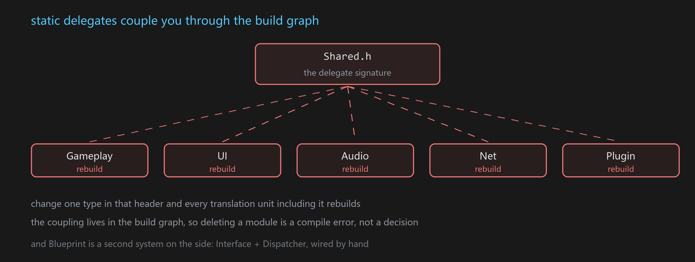

## 两行代码

```cpp
FGMPHelper::NotifyMessage(MSGKEY("Common.Action"), P1, P2);

FGMPHelper::ListenMessage(MSGKEY("Common.Action"), this,
    [this](Type1& P1, Type2& P2){ /* ... */ });
```

C++、蓝图、脚本用的是同一套 key。

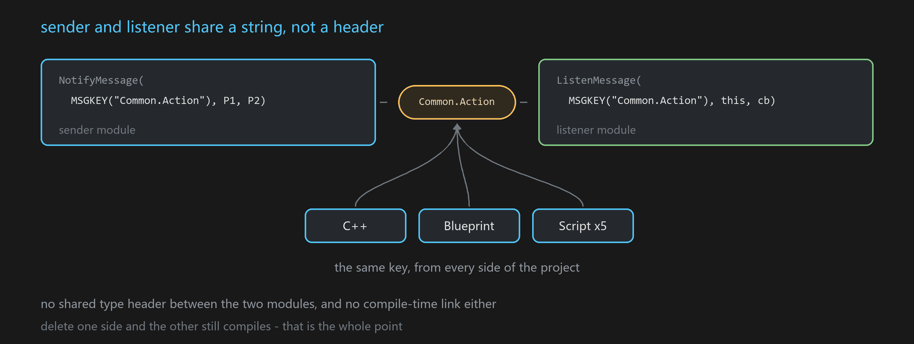

有人第一反应是：字符串没有类型检查，出错怎么办？签名在编辑期会被收集、被校验，蓝图节点还能据此自动长出引脚，脚本侧有补全和红线。**该有的安全一样不少，只是检查发生的时机换了地方。**

## 能力总览

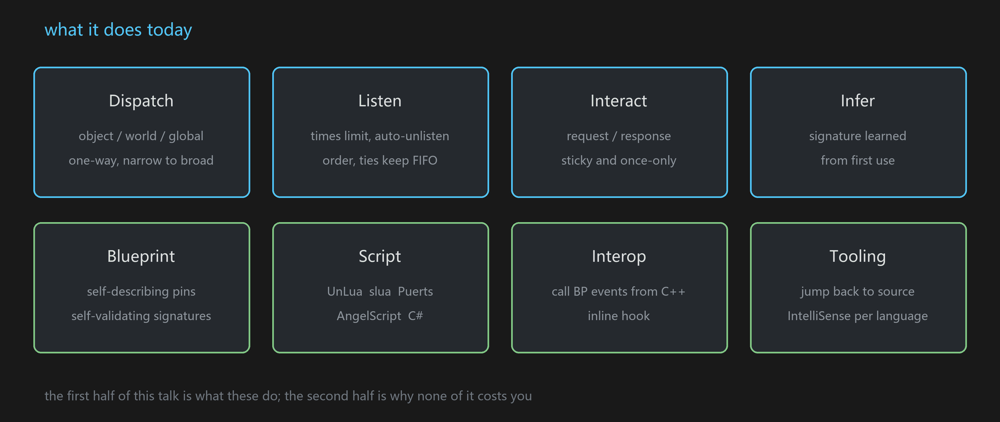


# 第一部分 · 怎么用

*插件提供什么能力，以及在调用点上写起来是什么样子。*

## 消息

### 分发的三层

```cpp
NotifyObjectMessage(Actor, KEY, ...);   // 对象级
NotifyWorldMessage (World, KEY, ...);   // World 级
NotifyMessage      (       KEY, ...);   // 全局
```

用某个 Actor 发一条，三种监听者都会收到：盯这个 Actor 的、盯它所在 World 的、盯全局的。**反过来不成立** —— World 级广播不会触发只盯某个 Actor 的监听。

World 这一层在 PIE 多开时天然隔离，不用自己判断是哪个实例。

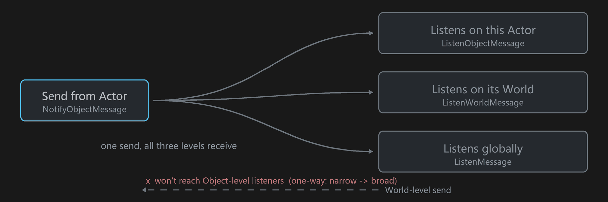

发送源不限于 `UObject`。继承 `ISigSource`，或用 `GMP_EXTERNAL_SIGSOURCE` 注册一下，**任意一块内存地址都能当消息源** —— 自定义数据结构也能被"订阅变化"。

### 限次和排序

```cpp
ListenMessage(KEY, this, cb, { .Times = 3, .Order = -10 });
```

- `Times` 默认 -1（永久）。设成 N，回调 N 次后自动退订。
- `Order` 默认 0，越小越先回调；相同的按注册先后。

Order 编进 GMPKey 高位，fire 前排一次序就完事，不额外维护结构；排序稳定，所以同序天然是 FIFO。

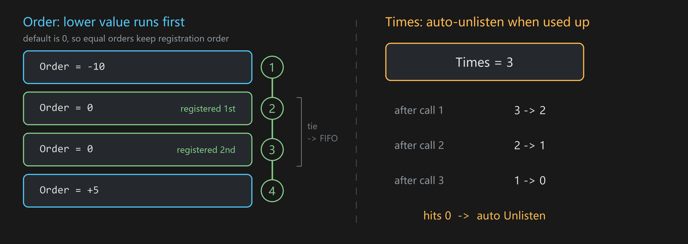

### 一问一答

```cpp
// 发的时候最后带个回调，就变成 Request
SendObjectMessage(Src, KEY, Args..., [](FResult& r){ /* 回包到了 */ });

// 收的时候最后一个参数写 FGMPResponder&，编译期就认出这是要回话的
ListenObjectMessage(Src, KEY, this,
    [](FArgs& a, FGMPResponder& Rsp){ Rsp.Response(FResult{...}); });
```

请求和回包靠一个自增 Seq 关联，回调一次性，用完销毁。不用为一次异步查询定两个 key。

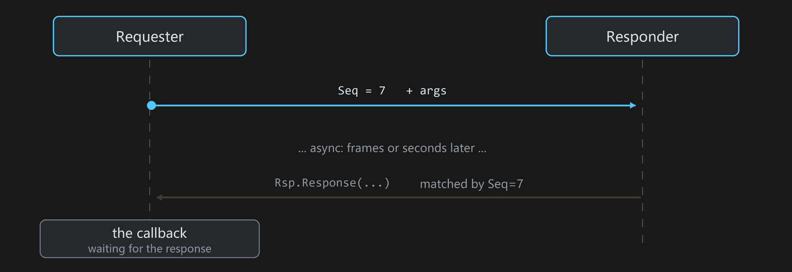

### 粘性消息

```cpp
StoreObjectMessage(Actor, MSGKEY("game.ready"), Data);  // 存住最新的
OnceObjectMessage (Actor, MSGKEY("boot.done"),  Data);  // 只送一次

// 之后才注册的监听，照样立刻收到
ListenObjectMessage(Actor, MSGKEY("game.ready"), this, [](FData& d){ ... });
```

解决"广播发生在监听注册之前"的时序问题。`Store` 存最新值，适合表达状态；`Once` 一次性，第一个监听消费掉就删，适合"初始化完成"这种只需送达一次的通知。

底层打包存在 GC 安全的表里，按信号和来源两个维度索引；`ExactObjName` 可以在同一对象上区分多条独立的粘性消息。

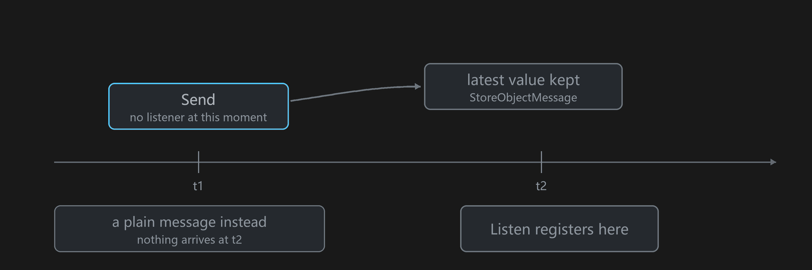

### 存一个数组，就是一张表

当存进去的是单个 `TArray<USTRUCT>`，监听方可以要整表、要固定一行、或者只要变动的行：

```cpp
StoreObjectMessage(Obj, MSGKEY("Inv.Items"), MyItems);   // TArray<FItem>，还是上面那个调用

// 列表本体：管容量和结构
ListenObjectMessage(Obj, MSGKEY("Inv.Items"), this,
    [this](const TArray<FItem>& All, const FGMPStoreUpdate& U){ ... });   // 是引用，不是拷贝

// 某一行的 widget：只有第 5 个位置的内容真变了才回调
ListenObjectMessage(Obj, MSGKEY("Inv.Items"), 5, this,
    [this](int32 Id, const FString& Name, int32 Count){ ... });
```

再存一次整个数组，GMP 自己算出哪里不一样再发，发送方不必描述自己改了什么。想原地改就用 `TGMPStoredArray<FItem>`：像数组一样用，改动自动累积，出作用域时一次性发出。这也是“同一个 key、不同的那一个”的第二种表达：第一种是每个实例一个 source，这里是一个 key 一张表 N 行 —— 适合运行期不断增减的实例，因为行的消费方持有的是位置而不是对象。

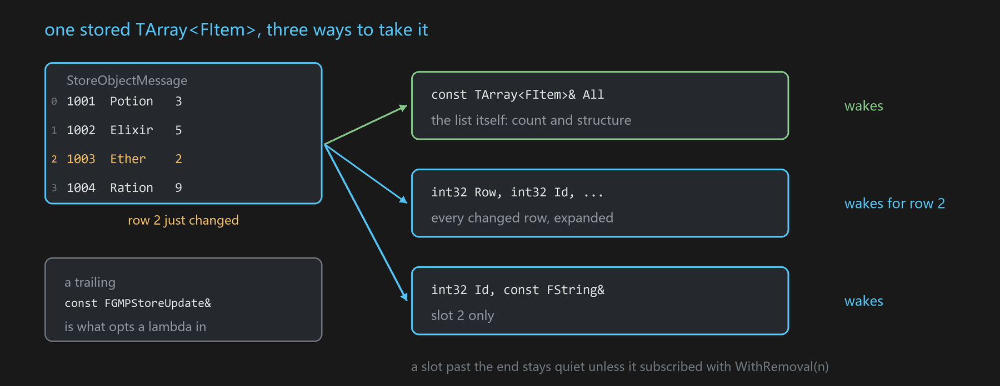

按行的形态通过反射按成员顺序展开，接收方模块**不需要 include 元素类型**。让 lambda 进入这套语义的开关只有一个：末尾多一个 `const FGMPStoreUpdate&`；其它监听一律不受影响。行号本身还兼作"这一行没了要不要通知我"的开关：`5` 静默跟随第 5 行，`GMP::WithRemoval(5)` 连消失也通知，`GMP::AllRows` 则是每个变化行。蓝图与脚本后端形态一致 —— 监听节点右键切到 *Row*，或在 Lua/TypeScript 里调 `ListenRowMessage`。

不值得存的表（每 tick 重算那种）直接发也行：普通 `SendObjectMessage` 一个 `TArray` 同样能到达 `AllRows` 监听者，表直接读发送方的实参。但仅此一种形态，且永远是整表重载 —— 没有存下来的旧表可比，就算不出变了哪几行；固定行订阅在这条路上会变成每次都醒而非只在自己那行变时醒，因此被明确挡掉。细节见 [Collection messages](https://github.com/wangjieest/GenericMessagePlugin/wiki/Collection-messages)。

### 参数兼容：接收方可以从后往前省

发送 `SendMessage(MSGKEY("ABC"), a, b, c)` 之后，下面几种监听都兼容：

```cpp
ListenMessage(MSGKEY("ABC"), this, [](TypeA a, TypeB b, TypeC c){});
ListenMessage(MSGKEY("ABC"), this, [](TypeA a, TypeB b){});
ListenMessage(MSGKEY("ABC"), this, [](TypeA a){});
ListenMessage(MSGKEY("ABC"), this, [](){});
```

语义类似函数默认参数：**可以给现有消息往后追加参数，不影响已有的监听代码。**

### 签名反推

不用先在 C++ 里声明，第一次用就把签名录进表。两个方向都能推：

- **发送侧**：tag 没注册过，就从脚本实参的实际值反推类型（lua 的 number 分整数和浮点，boolean / string / userdata 各自对应过去）
- **接收侧**：带静态类型的后端能从回调形参反推 —— AngelScript 的具名方法有 parm properties，C# 的泛型回调有类型标记。lua 那种动态回调没有静态类型，推不了

录进表之后，类型校验、智能提示、codegen 就都有了。这一段在 Editor / Development 下生效（`GMP_WITH_DYNAMIC_CALL_CHECK`），Shipping 里整段编译掉。

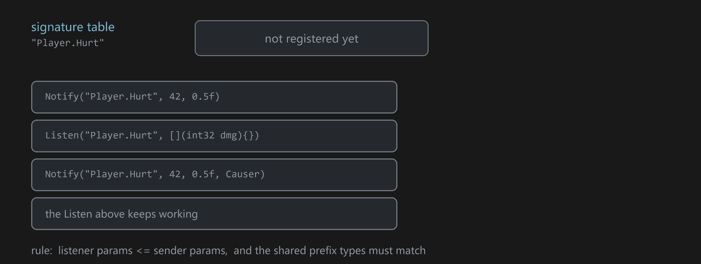

---

## 蓝图

### 自解释 · 自校验

**自解释** —— 在蓝图里放一个 GMP 消息节点，下拉选中一个 Tag，节点按签名表长出这个 Tag 的参数引脚：类型、名字、默认值都对。换一个 Tag，引脚当场重建。引脚形态是签名的投影，不需要手动配任何东西。

**自校验** —— 引脚类型既然来自签名表，连错类型在蓝图编译期就被拒绝，不用等到运行时。校验发生在 uncook 阶段的蓝图编译流程里，编译产物不额外携带校验信息。Editor / Development 下还有一层运行期一致性检查（`GMP_WITH_DYNAMIC_CALL_CHECK`）：签名与历史记录不符会告警并中止本次派发，兼容则更新签名表。

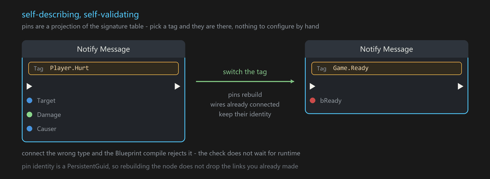

### Neuron：一套能扩展的节点基建

消息节点只是其中一个。底下那层叫 **Neuron**，是一套自解释 K2Node 的基建 —— 引脚带 PersistentGuid，节点重构时引脚身份不丢，已经连好的线不会断。

在它上面长出来的节点：

| 节点 | 做什么 |
|---|---|
| **NeuronAction** | 选一个异步动作的工厂函数，节点自己展开：输入是 Spawn 参数，每个回调 delegate 变成一个独立的输出执行引脚（各自带自己的数据引脚），外加 Cancel |
| **GenericInvoker** | 沿成员链走到目标对象，读成员值或调函数。ExpandNode 把整条链展开成 FName 字面量，**编译出来的蓝图不硬引用那个目标类** |
| **StructUnion 一组** | Set/Get StructUnion、StructTuple、DynStructOnScope，异构数据的打包和取用 |
| FormatStr / EventGraphFunction / DerefParam | 零碎但常用 |

GMP 自带一个 NeuronAction 的实例 —— `UGMPJsonHttpUtils`，类上直接标了 `meta = (NeuronAction)`：

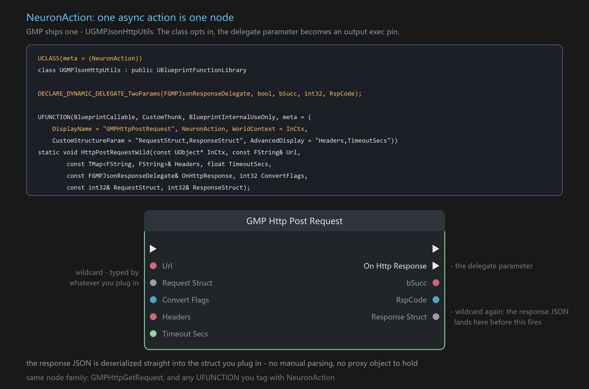

`CustomStructureParam` 让请求体和响应体都是 wildcard，连什么就是什么类型；响应 JSON 在执行引脚触发前就已经反序列化进你连的那个结构体 —— **不用手写解析，也没有 proxy 对象要管**。

---

## 脚本

### 五种语言，写法不用改

UnLua、slua、Puerts、AngelScript、C#。

```lua
-- 脚本里照旧这么写
NotifyObjectMessage(self, "Player.Hurt", dmg, causer)
```

加载或编译的时候，这行会被自动改写成 key 固化过的强类型调用。四种脚本四个介入点：

| 后端 | 介入时机 |
|---|---|
| UnLua / slua | 加载期改文本（`FUnLuaDelegates::CustomLoadLuaFile` / `setLoadFileDelegate`） |
| AngelScript | 编译前 preprocessor（`OnPostProcessCode`） |
| Puerts | tsc 的 AST 变换 |
| C# | 不需要改写 —— 强类型语言，泛型 `MsgTag<T...>` 让编译器直接约束住 |

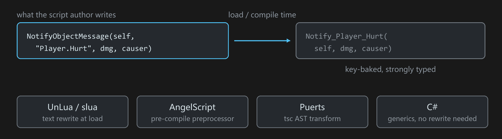

策划写的还是那个通用的 `NotifyObjectMessage`，一个字不用改；真正跑的是编译期生成的强类型函数，走 key 固化的快路径。

### 智能提示

签名表 codegen 成各语言自己的声明形式，写错类型当场红线，签名变了自动重新生成。

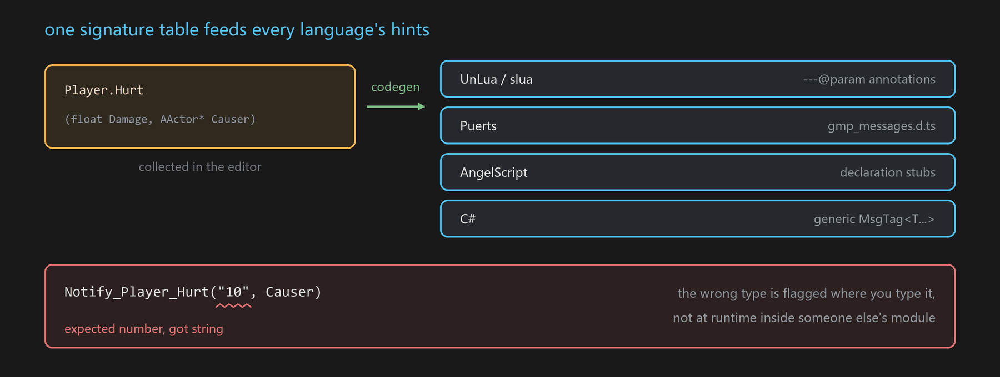

### 跳转追踪

脚本每次收发消息，用各语言引擎**自带的**调试接口抓到调用点的文件和行号 —— lua 用标准 debug 库，Puerts 用 v8 StackTrace，AngelScript 用它的 context，C# 用编译器注入的 CallerFilePath。**GMP 不改这些引擎的任何东西，只读它们本来就维护的调试信息。**

在 MessageTag 面板里点一下，IDE 就打开那个文件跳到那行；同一个面板里还并排列着这个 Tag 的蓝图节点和引用它的资产。

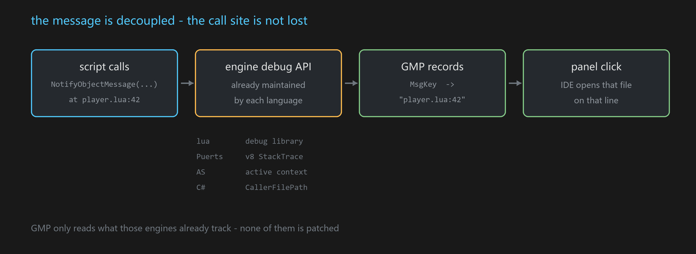

---

## 跟现有代码挂接

**RefEvent** —— C++ 直接调蓝图事件，而且能拿回结果。蓝图的 CustomEvent 是 void 的，本来没有返回值，靠 out 参数直接写回 C++ 的栈变量：

```cpp
int32 out = -1;
TGMPBPFastCall<void(int32, int32&)>::FastInvoke(Obj, Func, 21, out);  // out == 42
```

走编译期签名匹配的快路径，不经过 `ProcessEvent` 那套反射。

**InlineHook** —— 给任意非虚函数打内联 Hook，Windows / Linux / Android 都能用。

两个的共同点是**不动被挂接的那一方**。

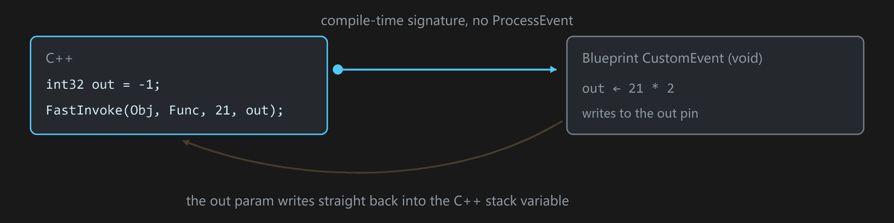

### 还有一些顺手的

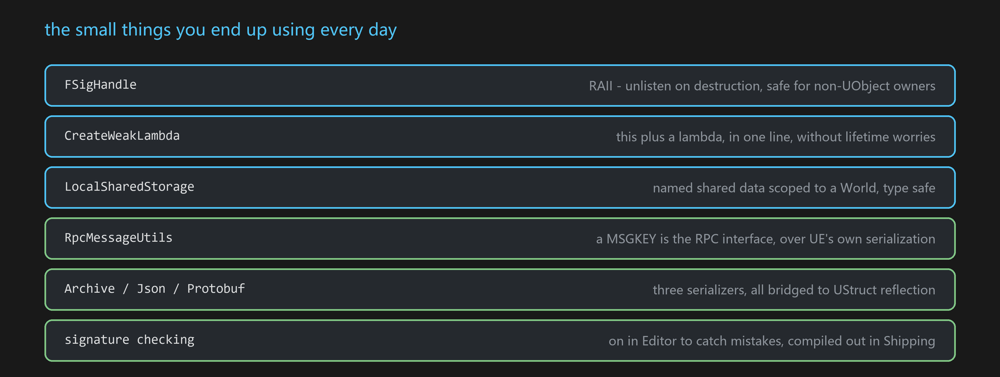

- `FSigHandle` —— RAII，析构自动退订，非 UObject 的类也能安全用
- `CreateWeakLambda` 系列 —— `this` 加 lambda 一行完成绑定，同时支持智能指针（`CreateSPLambda`）
- `LocalSharedStorage` —— World 范围内的命名共享数据，类型安全
- `RpcMessageUtils` —— MSGKEY 直接当 RPC 接口，走 UE 的网络序列化
- `GMPArchive` / `GMPJson` / Protobuf(upb) / YAML —— 都能桥到 UStruct 反射；`FGMPValueOneOf` 做动态取值
- `TGMPNativeInterface` —— 基于 Native 接口的消息交互
- `Class2Name` / `Class2Prop` —— 类型 ↔ 名字 ↔ `FProperty*`，编写库代码和支持函数时可省下大量样板

---

## 安装

1. 把 `Plugins/GMP` 放进项目的 `Plugins/` 目录（或引擎的 `Engine/Plugins/`）
2. `.uproject` 里启用 GMP
3. 重新生成工程文件并编译

也可以从 [Unreal Marketplace](https://www.unrealengine.com/marketplace/en-US/product/genericmessageplugin-gmp) 获取。


# 第二部分 · 怎么做到不慢

*上面那些为什么不用拿运行期开销换。本部分的数字是实测的，不是估的。*

## 一次消息花在哪

朴素做法是 `"Common.Action"` → `FName` → `TMap` 哈希查表 → store → 派发。消息是高频路径，一帧几百上千次是常态，每次都做一遍哈希查表并不划算。**而这个字符串，编译期就知道了。**

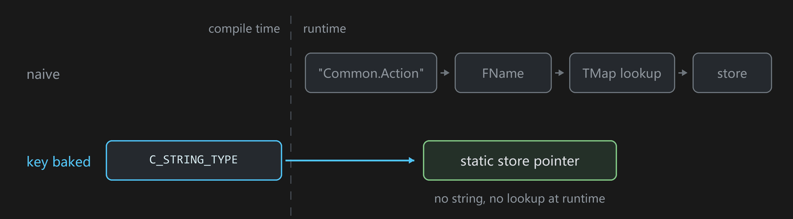

## key 固化

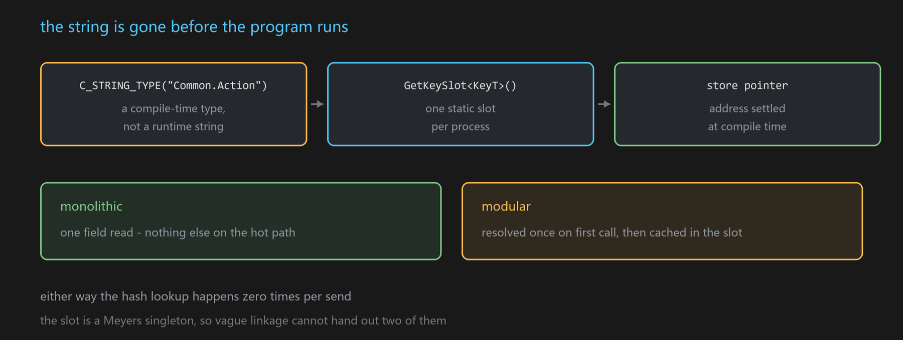

```cpp
C_STRING_TYPE("Common.Action")   // 编译期类型，不是运行期字符串
GetKeySlot<KeyT>().GetStore()    // 进程里唯一的那个静态 store
```

monolithic 下就是一次字段读；模块化下第一次解析一次然后缓存在 slot 里。**两条路的哈希查表次数都是零。** slot 是 Meyers singleton，vague linkage 不会发出两个实例。

## 派发栈有多深（实测）

单测里在 listener 内部 `FPlatformStackWalk::CaptureStackBackTrace`，数 send 调用点到回调之间的 GMP 帧：

| 构建 | by-name（FName + 查表） | by-store（key 固化） |
|---|---|---|
| 未优化（DebugGame） | 9 层 | 7 层 |
| 优化后（Development） | 4 层 | **3 层** |

未优化那 9 层里，大半是类型擦除用的脚手架 —— 适配层、派发 lambda、`FlexBackendThunk`、`TGMPFunction::operator()`、拆包 thunk。开了优化这 5 层被编译器整个吃掉，派发循环直接落到你的回调上。

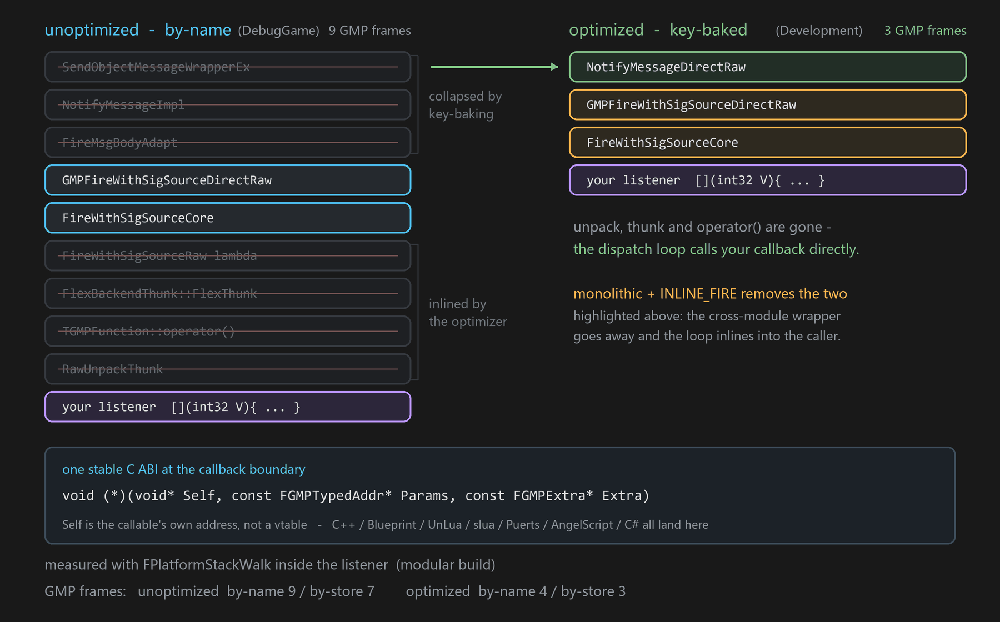

剩下 3 层里 `GMPFireWithSigSourceDirectRaw` 带 `GMP_API` 导出，模块化下跨 DLL，优化器过不去这道墙。`GMP_WITH_INLINE_FIRE=1` 配 monolithic 就是拆这堵墙：`GMP_API` 展开为空，派发循环 FORCEINLINE 摊在头文件里由调用方展开，上面那 3 层里的前两层随之消失。

> 原始栈（带符号）和复现命令见 [docs/dispatch-stack-measured.md](docs/dispatch-stack-measured.md)。表里两行都是 modular 构建；INLINE_FIRE 需要 monolithic。

## 最后一跳

listener 存的是一个 thunk 函数指针加一个对象地址，**不是虚表**：

```cpp
reinterpret_cast<R(*)(void*, Args...)>(GetCallable())(GetObj(), Args...);
```

这句在函数末尾，-O2 会做 sibling call，直接 `jmp` 过去，不建栈帧。小 lambda 走 SBO 存在 16 字节槽里，不碰堆。

到这一步整条路上只剩一个运行期才知道目标的间接跳转 —— 这是观察者模式本身的下限，发消息的人本来就不知道谁在听。

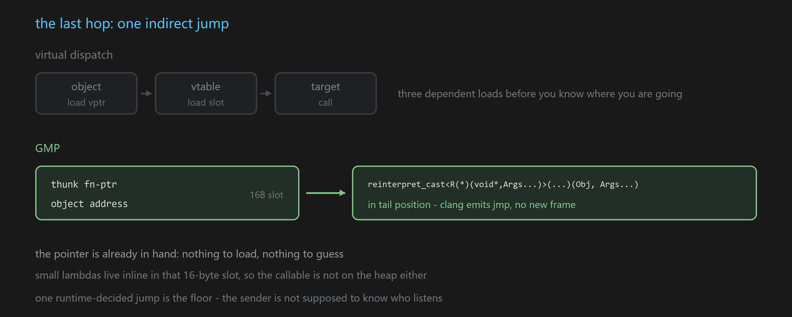

## 稳定的 C ABI

五种脚本的回调全都归一到同一个 C 签名。类型擦除之后，边界上就是这么个裸函数指针：

```cpp
void (*)(void* Self, const FGMPTypedAddr* Params, const FGMPExtra* Extra);
```

三个参数，首参 `Self` 是**可调用体自己的地址**，不是 UObject，也不是虚表指针 —— 所以这一跳是间接跳转，不是虚派发。

`Params` 是逐参数擦除后的地址数组。类型名有两条通路，别混了：

```cpp
struct FGMPTypedAddr {           // GMPStruct.h
    uint64 Value = 0;            // 恒有：地址擦成 uint64
#if GMP_WITH_TYPENAME            // = DYNAMIC_TYPE_CHECK || DYNAMIC_CALL_CHECK || TYPE_INFO_EXTENSION
    FName TypeName;              // 只有 Editor / Development 才随行
#endif
};

struct FGMPExtra {               // 同文件
    int32 Size;                  // 参数个数
    const FName* TypeNames;      // 每个签名一份的静态类型名表
    FSigSource Source; FName Key; FGMPKey Seq;
};
```

也就是说 **Shipping 下 `FGMPTypedAddr` 退化成一个裸 `uint64`**，`Params` 就是纯粹的地址数组，逐参数的类型名整个编译掉；需要类型信息的场合走 `Extra->TypeNames` 配 `Extra->Size`。参数一律以地址数组的纯 C 形态过语言边界，每种语言只实现这一个入口。

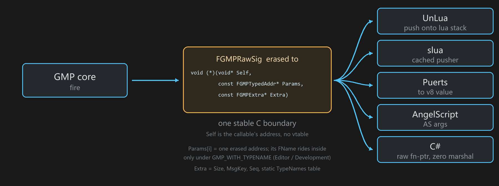

C# 把这条契约用到了极致：注册一个 `[UnmanagedCallersOnly]` 入口的裸函数指针，fire 时 native 直接调过去，**零反射、零 marshal**。

## 一次消息剩下什么

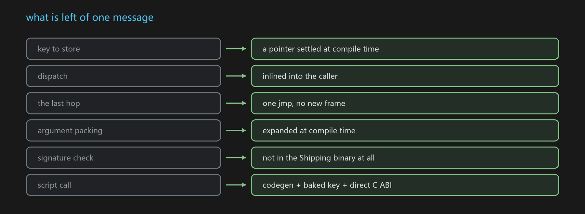

---

## 编译开关

| 宏 | 默认 | 作用 |
|---|---|---|
| `GMP_SIGNAL_BACKEND_FLEX` | `1` | 可插拔信号后端，存储 / ABI / handler 三个关注点正交，换后端不动调用点 |
| `GMP_WITH_DIRECT_SIGNAL` | `1` | 类型化直发路径 |
| `GMP_STATIC_STORE_MONOLITHIC` | `IS_MONOLITHIC` | key 固化到静态 store 的前提 |
| `GMP_WITH_STATIC_STORE` | 由上面两个推导 | `DIRECT_SIGNAL && STATIC_STORE_MONOLITHIC` |
| `GMP_WITH_INLINE_FIRE` | `0` | 派发循环内联进调用方，**需要 monolithic 才生效**（`GMP_WITH_INLINE_FIRE_ENABLED = INLINE_FIRE && STATIC_STORE`） |
| `GMP_WITH_DYNAMIC_CALL_CHECK` | Editor/Dev `1`，Shipping `0` | 签名一致性校验、签名反推 |
| `GMP_WITH_STATIC_MSGKEY` | `!WITH_EDITOR` | 运行期不再保留 MsgKey 字符串 |
| `GMP_SLUA_STATIC_BIND` / `GMP_UNLUA_STATIC_BIND` / `GMP_PUERTS_STATIC_BIND` / `GMP_CSHARP_STATIC_BIND` | `0` | 各脚本后端的 codegen 静态绑定 |

`GMP_WITH_INLINE_FIRE` 默认关：默认构建保持跨 DLL 边界干净、不涨代码体积，每次 fire 只多一次常数级的 out-of-line 调用。极致路径是给 monolithic 打包构建的**主动选择**。

所有配置（modular / monolithic、默认后端 / Flex 后端、inline / out-of-line fire）跑的是同一套单测，**69 个用例全过** —— 分层开关拿体积换开销，不拿正确性换。

---

---

## 深入阅读

- [旧版 README 存档](README_old.md) —— 重写前的文档，逐字保留。设计缘由只有那里讲了：面向对象的消息传递、类型擦除、`FSigSource`、`FMessageBody`、`Class2Name` / `Class2Prop`。其中的性能一节已被上面的实测取代
- [派发栈深度实测](docs/dispatch-stack-measured.md) —— 原始栈、符号、复现命令

## License

见 [LICENSE](LICENSE)。
