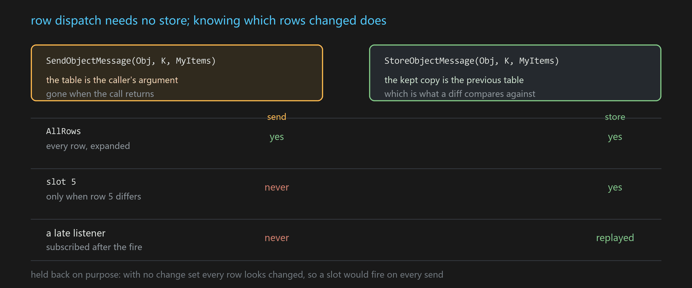

# 当 SendMessage 是一个数组：GMP 针对集合型消息的优化

本文记录 GMP（GenericMessagePlugin）最近的一轮改动：**让消息系统看见数组里的「行」**。

起点是一个很小的场景——发一条消息，参数是个数组。这件事一直能做，只是接收方拿到的粒度太粗。顺着「怎么把粒度做细」往下走，会自然走到 StoreMessage 上，也顺带回答了「同一类对象有很多个消息该怎么发消息」这个老问题。


---

# 场景与用法

## 一、发一个数组，接收方得自己干很多活

数组当消息参数，本来就是合法的：

```cpp
USTRUCT() struct FItem
{
    GENERATED_BODY()
    UPROPERTY() int32   Id;
    UPROPERTY() FString Name;
    UPROPERTY() int32   Count;
};

FGMPHelper::SendObjectMessage(Obj, MSGKEY("Inv.Items"), MyItems);   // TArray<FItem>

FGMPHelper::ListenObjectMessage(Obj, MSGKEY("Inv.Items"), this,
    [this](const TArray<FItem>& All){ RebuildWholeList(All); });
```

能跑，但接收方要自己做三件事：

**一是自己遍历。** 消息把整个数组交给你，怎么拆是你的事。

**二是每个消费者自己判断「这条是不是我的」。** UI 的形状恰恰是一行一个 widget——第 5 格的 widget 只关心第 5 格。现在它得收下整个数组、自己取下标 5、自己比对有没有变。N 个 widget 就是 N 次全量回调，N-1 个立刻返回。

**三是必须知道 `FItem` 是什么。** 接收方要 include 元素类型的头文件。这恰恰是消息系统想帮你避开的耦合——参数类型都解耦了，元素类型却没有。

数组这个形状里明明有「行」这个维度，消息系统却看不见它。这轮改动就是让它看见。

## 二、按行分发：一个 send 就能用

当一条消息的**单个参数**是「USTRUCT 数组」时，GMP 认出它是一个**集合**，监听侧多出按行订阅的能力：

```cpp
// 发送侧一个字没改
FGMPHelper::SendObjectMessage(Obj, MSGKEY("Inv.Items"), MyItems);

// 接收侧：每一行来一次，成员直接展开成实参
FGMPHelper::ListenObjectMessage(Obj, MSGKEY("Inv.Items"), GMP::AllRows, this,
    [](int32 Row, int32 Id, const FString& Name, int32 Count){ UpdateRow(Row, Id, Name, Count); });
```

注意这个 lambda：**没有出现 `FItem`**。行的成员按元素结构体的声明顺序、通过反射展开成实参。UI 模块消费 gameplay 模块定义的表，不需要 include 那个头文件——原本解耦的是「消息的参数类型」，现在连「表元素的类型」也一起解开了。

lambda 还可以只声明前几个成员（GMP 本来就允许监听器少收尾部参数），只关心 `Id` 的地方写一个参数就够。


识别是从**存进去的形状**来的，不是从新的函数名来的。所以：**不想用的人完全不用学**，上一节那段整表监听的老代码行为不变。所有新语义的开关只有一个——lambda 末尾多声明一个 `const FGMPStoreUpdate&`（或者用带 Index 的重载）。没声明就是普通监听。

到这里，第一件和第三件活都省掉了。但第二件——**「只在我这行变了的时候叫我」**——还差着。

## 三、要「变了哪几行」，就得先有「上一次」

固定行订阅是这样的：

```cpp
// 只在位置 5 的内容变了的时候才回调
FGMPHelper::ListenObjectMessage(Obj, MSGKEY("Inv.Items"), 5, this,
    [](int32 Id, const FString& Name, int32 Count){ ... });
```

这正是虚拟列表 row widget 想要的形状。但它成立的前提是：系统能判断出「位置 5 现在跟刚才不一样了」。

而 `SendObjectMessage` 给不了这个判断。它是事件语义：发出去，当时在听的人收到，**发完就没了**。下一次再发一个数组，系统手上没有上一份可以对比，算不出变了哪几行。

所以这条分界很明确：

> **按行分发不需要存储；「变了哪几行」需要。因为「增量」的前提就是「有上一次」。**



于是 send 这条路上，集合能力是**打折**的：只有 `AllRows` 一种形态，而且每次都当作整表重载。固定行订阅在这条路上被**明确挡掉**了——不挡的话它会每次 send 都醒，而它的存在理由恰恰是「别人变化时我不醒」，那还不如不订。**静默不工作，比每次乱醒好查。**

这个打折版本本身是有用的，适合那种**每 tick 重算、上一份立刻作废**的表：雷达光点、当前可见的敌人、附近可交互物。为这种数据维护存储纯属负担，你要的只是「按行展开 + 零类型依赖」这层便利。

但如果需要完整能力，就得让系统留住「上一次」。

## 四、StoreMessage：让消息表达「现在是什么」

GMP 里之前实现过这个功能，而且它本来是为另一个问题存在的。

普通 send 是事件语义，这对「刚刚发生了什么」是对的——玩家开火、怪死了、按钮被点。但很多东西天然是**状态**：当前关卡配置、玩家金币数、背包里有什么。状态用事件语义会撞上一个很烦的时序问题——**广播发生在监听之前**。数据模块初始化时把配置广播出去，此时 UI 还没创建；等 UI 创建好去监听，那条消息早过去了，只能干等下一次变化，而下一次可能永远不来。

`StoreObjectMessage` 就是干这个的：

```cpp
FGMPHelper::StoreObjectMessage(Obj, MSGKEY("Inv.Items"), MyItems);   // 发出去，同时留最新一份
```

之后**任何时刻**有人来监听这个 key，立刻拿到一次回放，就像他一直在听一样。UI 什么时候创建都无所谓。

（近亲是 `OnceObjectMessage`：也存，但被第一个监听者消费掉就删除。`Store` 适合状态，`Once` 适合一次性的完成通知。）

关键在于，**它留下的那一份，正好就是「上一次」**。有了它，下次再存同一个 key 时，GMP 能拿 `UScriptStruct::CompareScriptStruct` 逐行比对，算出实际变了哪些：

```cpp
FGMPHelper::StoreObjectMessage(Obj, MSGKEY("Inv.Items"), MyItems);   // 甩整份，GMP 自己算出变了哪几行
```

**发送方不需要描述自己改了什么**——「甩一整个数组」和「精确描述改动」的通知精度是一样的。这条对老代码尤其友好：原来怎么写还怎么写，订阅方却已经能拿到精确的行信息了。

于是三种订阅形态都齐了：

```cpp
// 整张表——拿到的是存着的那个数组的引用，不是拷贝
ListenObjectMessage(Obj, K, this,
    [](const TArray<FItem>& All, const FGMPStoreUpdate& U){ ... });

// 盯住第 5 个位置——只在位置 5 的内容变了才回调
ListenObjectMessage(Obj, K, 5, this,
    [](int32 Id, const FString& Name, int32 Count){ ... });

// 每个变化的行来一次
ListenObjectMessage(Obj, K, GMP::AllRows, this,
    [](int32 Row, int32 Id, const FString& Name, int32 Count){ ... });
```

收到的通知长这样：

```cpp
struct FGMPStoreRange { int32 Index; int32 Count; };

struct FGMPStoreUpdate
{
    int32 TotalCount;                          // 变化后的总行数
    TArrayView<const FGMPStoreRange> Ranges;   // 哪些行现在读起来不一样了
    int32 PrevTotalCount;                      // 变化前的总行数
    int32 Row;                                 // 行回调专用
    ...
};
```

没有 Add/Change/Remove 枚举，也没有 Reset——两个维度已经把它带出来了（理由放在下半部分）。改第 3 行总数不变；在第 3 行插入总数 +1；删第 3 行总数 -1。

### 两条路的分工

| | `SendObjectMessage` | `StoreObjectMessage` |
|---|---|---|
| 晚来的监听者 | 什么也收不到 | 立刻回放一次 |
| 变了哪几行 | 只有「整表」 | 精确到 range |
| 固定行订阅 | **不响应** | 可用 |
| 增量写（下一节） | 不可用 | 可用 |
| 适合 | 每 tick 重算、上一份立刻作废 | 有保留价值的状态 |

## 五、增量写入：像 TArray 一样用

有了 store，还能反过来——不重发整份，直接原地改：

```cpp
{
    TGMPStoredArray<FItem> Arr(Obj, MSGKEY("Inv.Items"));
    Arr.GetMutable(5).Count -= 1;
    Arr.Add(FItem{1002, TEXT("Elixir"), 5});
    Arr.RemoveAt(7);
}   // 析构时发一次，改动区间已经合并
```

这条路的增量信息不是「比」出来的，是写入方**自己记的**——每次 `GetMutable`/`Add`/`RemoveAt` 都往一个区间累加器里记一笔，出作用域时一次性发出去。

两个用起来会碰到的约束：

**只能建在栈上**——`operator new` 和拷贝/移动构造都删了。它靠析构发通知，一旦允许当成员存着，通知时机就没人说得清。

**`operator[]` 只有 const 版本，写走 `GetMutable(i)`。** 非 const 的 `operator[]` 返回引用之后，wrapper 无从知道调用方到底改没改，只能保守标脏——于是「读一下」也会触发全 UI 刷新。把写显式化，误报就没了。

## 六、固定行是「位置」，不是「元素」

使用之前必须先理解的一条语义。订阅第 5 行的意思是**「第 5 个位置上显示的是什么」**，不是「某个特定的元素」：

| 发生了什么 | 盯着位置 5 的订阅者 |
|---|---|
| 改第 5 行 | 回调 |
| 改第 3 行 | 不回调 |
| 在第 3 行插入 | **回调**——原来的第 4 行挪到位置 5 了 |
| 删第 3 行 | **回调**——原来的第 6 行挪到位置 5 了 |
| 在第 8 行增删 | 不回调 |


这正是虚拟列表 row widget 要的：它就是「屏幕上第 5 格」，谁被设置进来它就显示谁。

### 位置没了怎么办

要不要收到「你这个位置没了」，由订阅方在 listen 那一行显式选择。编码用一个对称的 `~`：

| `Index` | 含义 | 位置消失时 |
|---|---|---|
| `5` | 位置 5 | 不通知 |
| `GMP::WithRemoval(5)`（即 `~5`） | 位置 5 | 通知 |
| `GMP::AllRows`（`MAX_int32`） | 每个变化行 | 不通知 |
| `GMP::AllRowsWithRemoval`（`~MAX_int32`） | 每个变化行 | 通知 |

回调侧同一条规则：`U.Row >= 0` 是活着的行，`U.Row < 0` 表示 `~U.Row` 这行没了，此时数据参数是**默认构造的占位值，不能读**。

```cpp
FGMPHelper::ListenObjectMessage(Obj, K, GMP::WithRemoval(5), this,
    [](int32 Id, const FString& Name, int32 Count, const FGMPStoreUpdate& U)
    {
        if (U.IsRowRemoved()) { PlayExitAnim(); return; }   // Id/Name/Count 此时是默认值
        Label->SetText(Name);
    });
```

为什么要显式选？因为**这个通知有成本**：一张 10 行的表 `SetNum(3)`，如果都这么做的话，删除通知的订阅者会收到 7 次回调。这个成本该由确实需要它的人付。放在 listen 那一行，意图也一眼可见。

另外，位置消失**不会让订阅失效**——表又长回来，它继续收到回调。它订的是位置，位置一直在。

## 七、顺带回答的老问题：一个 key，N 个实例

做完之后回头看，这套东西其实回答了 GMP 里一直有点尴尬的一个问题：同一类东西有很多个，消息该怎么发送。

这个问题原本有答案，只是有适用范围。


**原有的答案是让「源」去区分。** GMP 的派发不只有消息名一个维度，还有正交的 SigSource。五个队伍成员就是五个 UObject，各自 `SendObjectMessage(MemberObj, MSGKEY("Party.HP"), NewHP)`，血条 widget 监听自己那个 Member。一个 key，五个实例，互不干扰；而且对象销毁时，以它为源的监听和 sticky 消息全部自动摘掉，生命周期由引擎兜底。

**如果实例不是独立对象，而是同一个对象上的若干逻辑分区**，还可以用「对象 + 名字」构造复合源：

```cpp
FSigSource Src = FSigSource::MakeSigSourceKey(ManagerObj, TEXT("HP"));
```

蓝图侧对应 `FGMPObjNamePair{Obj, Name}` 那个 pin。一个 Manager 上挂 `"HP"` `"MP"` `"Stamina"` 三条互不干扰的同名消息，这样写很顺手。

**但名字这条路有边界：它要求名字是固定的、双方都预先知道的。** 一旦名字是动态产生的、数量还不定，三件事会挡住你：

- **订阅方得先知道名字。** `listen` 要传 name。名字运行时才产生（动态生成的实体、服务器下发的条目），订阅方无从得知，而消息系统里没有「有个新名字出现了」这种元通知——它只能等，可它连等什么都不知道。
- **问不出「一共有几个、都有哪些」。** 每个 `(Obj, Name)` 是独立的源，各存各的，没有汇总视图。而这恰恰是列表 UI 要做的第一件事：先知道有多少行。
- **如果不使用的话不会自己消失。** 清理只有两条路——源对象销毁时批量清、或显式调 `RemoveSourceKey`。名字动态生成、用完就弃的话，只要宿主对象还活着，那些记录就一直堆着。

而这三件事，集合的行天然就有：增删就是数组增删，没有额外分配；整表订阅者天生知道 `TotalCount` 和全部内容；行没了就是元素没了，不需要谁记得去清。

### 所以怎么选

真正的分界不是「实例多不多」，而是：

> **这个实例的身份，是一个对象，还是一个位置？**

|  | 一个 key，多个 **source** | 一个 key，一张表，多个 **行** |
|---|---|---|
| 怎么区分实例 | 每实例一个 `FSigSource`，或 `对象+Name` 复合源 | 数组下标 |
| 身份是什么 | 对象本身 | 位置 |
| 适合 | 长生命周期、自己持有状态、别人会持有引用 | 频繁增删、被复用 widget 消费 |
| 名字/数量 | 需要固定且双方预知 | 动态增删是常态 |
| 生命周期 | 随源对象消亡，自动清理 | 行就是数组元素 |
| 每实例开销 | 一个对象，或复合源表里一条 | 无 |

**这个选择有真实代价**：位置不是身份。如果语义是「头部装备槽，我不管别的槽怎么变」，下标表达不了——在它前面插入任何元素的话，它本身就漂了。这种情况要的是「元素上有个 key 字段，按 key 订阅」，是另一件事，故意没揉进来。

到这里用法就齐了。下面是实现。

---

# 实现细节

## 八、识别与存储：两样东西都是现成的

**识别**按 runtime struct 缓存，只做一次：

```cpp
TFieldIterator<FProperty> It(RuntimeStruct);
if (const FArrayProperty* ArrProp = It ? CastField<FArrayProperty>(*It) : nullptr)
    if (const FStructProperty* ElemProp = CastField<FStructProperty>(ArrProp->Inner))
        ...   // 记下数组偏移、元素类型、元素大小
```

**存储没有新造轮子。** `FGMPStructUnion` 本来就是个数组容器——`ArrayNum`、`GetDynamicStructAddr(Type, idx)`、`MakeArray(TArrayView)` 都是现成的。它的拷贝构造会把自己变成 view（`ArrayNum` 取负、共享同一个 `TSharedPtr<uint8>`），并且**没有 COW**，所以原地改之前必须先独占化。

而这个独占化也是现成的——`EnsureMemory` 的第一个判断条件就是 `ArrayNum < 0`：

```cpp
if (ArrayNum < 0 || (OldStructType != NewStructPtr) || !OldStructType || ...)
{
    // 重新分配 + 深拷贝
}
```

命中就重分配深拷贝。整个「写时复制」一行没写，wrapper 构造时调一次 `EnsureUnique()` 就完了。

StoreMessage 那层的 payload 存在按 `signal store × source` 两级索引的表里，持有它的 `FGMPStoreMsgHolder` 是个 `FGCObject`：

```cpp
virtual void AddReferencedObjects(FReferenceCollector& Collector) override
{
    for (auto& StorePair : StoreMsgsMap)
        for (auto& Pair : StorePair.Value)
            Pair.Value.AddStructReferencedObjects(Collector);
}
```

payload 里的 `UObject*` 因此不会被 GC——「存着」这件事必须自己兜住的责任。集合继承了这一整套，没有额外的生命周期代码。

## 九、为什么通知里没有 Action 枚举

两个维度已经把它带出来了：数量维度说「表有没有变长变短」，位置维度说「从哪开始」。三种情况订阅者自己就能推。多一个枚举，就多一处**可能和事实不符**的信息——写的人要保证它和 range 一致，读的人要判断信谁。

同理，也没有 `Reset`：整表变化就是一个覆盖全范围的 range，比 `Reset` 信息量更大——`Reset` 只说「全变了」，range 还告诉你边界在哪。

唤醒规则也是从这两个维度推的：总数没变（纯内容改）只唤醒 Range 覆盖到的行；总数变了则唤醒 `Row >= min(Range.Index)` 的所有行——插入或删除之后，那个位置往后的内容全都换人了。

## 十、send 这条路：表就是发送方的实参

下面把这条路径上那张表叫 **易失表**——借 UE 里 `UPROPERTY(Transient)`、`RF_Transient` 那个「不持久」的意思：它不是 store 里那份能一直待着的表，而是发送方栈上的实参，这次调用结束就没了。代码里对应 `GMPDispatchTransientRows` 和派发函数上的 `bTransient`。

集合派发本来只挂在 store 的写入路径上。send 那条路上加的是一个对称的分支：

```cpp
GMP_IF_CONSTEXPR(Flags == 0 && !SendTraits::bIsSingleShot)
{
    // Nothing is stored, so the argument itself is the table for the duration of this call.
    if (GMPHasStoreListeners())
        GMPDispatchTransientRows(InSigSrc, MessageKey, SendTraits::AsPropRefArray(TupRef));
}
```

`GMPHasStoreListeners()` 挡在最前面：**全项目没有任何集合监听者时，连参数数组都不会构造**，普通 send 的开销一点没变。

View 直接从实参地址造。这一步能成立是因为 `FGMPPropStackRef` 本来就同时带着地址和 `FProperty`：

```cpp
struct FGMPPropStackRef
{
    uint8* Addr = nullptr;
    const FProperty* Prop = nullptr;
};
```

有 `FArrayProperty` 就能拿到 `Inner`（元素 property）、元素 struct 和元素大小，四个构造参数齐了——和 `GMPMakeStoreView` 从 store 内存里造的那个是同一套，只是地址来源不同。借用语义也一致：都只在回调期间有效。

**为什么必须挡掉固定行**，这里给依据。`ShouldWakeRow` 长这样：

```cpp
if (Row == AllRows)
    return true;
if (Row >= Update.TotalCount)
    return bWantRemoval && Row < Update.PrevTotalCount;
if (Update.IsFullReload())
    return true;                    // ← transient 永远命中这一条
...
```

易失性派发的 `Ranges` 是空的，`IsFullReload()` 恒为真，于是**每一个固定行订阅者每次 send 都会被唤醒**。这正好和固定行的语义相反。所以在派发循环最前面加了一条过滤：

```cpp
if (bTransient && Item.Row != AllRows)
    continue;
```

顺带，`LastCounts`（每个 source 上次的行数，用来判断 resize）在 transient 路径完全不碰——否则同一个 key 上 send 和 store 混用时，两边会互相污染对方的 resize 判定。

## 十一、区间合并必须排序

writer 内部是一个最多 8 段的区间累加器，相邻或重叠的合成一段，超过 8 段退化成「整表重读」。

这里有两种看着够用、实际不行的写法。

**「找到第一个相交的段，合并，return」** —— 某个段增长到**桥接了后面另一个段**时会留下重叠：

```
Spans = [{0,5}, {5,1}]     再来一次 Add(5,1)
  → 与 {0,5} 相交，合并成 {0,6}，return
  → Spans = [{0,6}, {5,1}]     ← 第 5 行落在两个段里
```

遍历时第 5 行被访问两次，逐行回调的订阅者对它触发两遍。

**「合并之后倒着扫一遍，把被吃掉的段删掉」** —— 也不够。反例 `[{0,6},{6,1},{20,1},{7,13}]`：倒序先看 `{7,13}` 时当前段还是 `{0,6}`（7 > 6，不相交）而跳过，之后它长到 `{0,7}`，却不会回头再看那个已经跳过的段。

正解是排序 + 相邻合并的标准区间合并：必然收敛，顺带让遍历行号变成递增的，对列表刷新更友好。

## 十二、按位置访问的前提：跳过 editor-only

```cpp
for (TFieldIterator<FProperty> It(ElemStruct); It; ++It)
{
    if (It->IsEditorOnlyProperty())
        continue;
    OutProps.Add(*It);
}
```

按位置访问的前提是「成员序列在所有配置下一致」。一个 `WITH_EDITORONLY_DATA` 成员会在 editor 下插在序列中间、以及 shipping 模式下消失，于是同一个 lambda 在 editor 里读第 2 个字段、打包后读第 3 个。这种 bug 只在打包版复现，最难查。

**任何「按位置访问反射成员」的机制都要处理这一条**，不只是 GMP。

## 十三、tuple 快路径，但正确性不依赖它

当 lambda 声明的参数恰好和元素内存布局对齐（同 offset、同宽度、同类型），行读取可以直接按编译期 offset 取，跳过反射。这条路径每行 0.9ns，反射路径 10ns。

关键在于**这个判断是运行期做的、失败就回退**，不是编译期假设。首次 fire 判一次、记住结果：

```cpp
if (Cache->DecidedFor != View.GetElementStruct())
{
    Cache->DecidedFor = View.GetElementStruct();
    Cache->bFast = TupleLayoutMatches<FastTuple, Tuple, 0>(...);
}
```

漏标一个 `UPROPERTY`、中间插了个 editor-only 成员、某个成员换成同宽度的不同类型——都只会让它退回反射路径，结果依然正确，只是慢一点。反过来做成「编译期假定布局成立」，同样的情况就变成「editor 里跑得好好的，打包后读错字段」。

一个可以带走的判据：**能用「运行期校验 + 自动回退」表达的优化，就别做成「编译期假定」**。前者的失败模式是变慢，后者的失败模式是读错数据。

## 十四、复合源为什么撑不住动态名字

上半部分说复合源的记录「不用了不会自己消失」，这里给依据。清理只有两条路。

一条是源对象销毁时，把它名下所有复合源批量清掉：

```cpp
std::set<FSigSourceExtKey, std::less<>> ToBeRemoved;
if (SigSourceExtStorages.RemoveAndCopyValue(InSig, ToBeRemoved))
{
    for (auto& ExtKey : ToBeRemoved)
    {
        FSigSource ExtSig;
        ExtSig.Addr = FSigSource::AddrType(&ExtKey) | FSigSource::ExtKey;
        SigSourceKeys.Remove(ExtSig);
    }
}
```

另一条是显式调 `RemoveSourceKey(Obj, Name)` 单个清。

**没有第三条。** 存储结构是 `TMap<FSigSource, std::set<FSigSourceExtKey, std::less<>>>`，每个名字是 set 里一个独立分配的节点。名字动态生成、用完就弃的话，只要宿主对象还活着，节点就一直在。一个滚动列表每帧换十几行，等于每帧在这张表上增删。

对照之下，集合的行就是 `TArray` 的元素，增删是数组自己的事，没有任何额外的登记与清理。

## 十五、开销

`-run=GMPUnitTest -Bench`，64 行，Development editor，三次取最好：

| | |
|---|---|
| 整表派发，1 个监听者 | 56 ns |
| 64 个固定行监听者，1 个该醒 | 253 ns |
| 每行 `ForEach`，编译期 offset | 0.9 ns |
| 每行 `ForEach`，反射 | 10 ns |
| *参照：*GMP 一次普通 slot send | ~690 ns |

集合派发比 GMP 自己的一次普通发送还便宜一个数量级，所以它不会是瓶颈。这个对比不是自夸——它说明「按行订阅」这层抽象本身几乎不要钱，值钱的是它省掉的那些空转唤醒。

## 十六、脚本和蓝图走同一个入口

四个脚本后端（slua、UnLua、Puerts、AngelScript）加蓝图，共用一个 `GMPListenScriptRows`。每个后端只提供一座桥，把 `(int32 Row, <元素>)` 这一对地址转成自己的可调用体：

```lua
local key = GMP.ListenRowMessage(WatchedObj, "Inv.Items", WeakObj, 5, function(Row, Item)
    if Row < 0 then return end          -- ~Row 这行没了，Item 是默认值
    Label:SetText(Item.Name)
end)
```

AngelScript 因为回调是强类型 funcdef，额外为每个集合 tag 生成一份声明，编译期就能查错：

```angelscript
funcdef void FOnRow_Inv_Items(int Row, FItem Item);
int64 asListenRow_Inv_Items(UObject WatchedObj, UObject WeakObj, int Index, FOnRow_Inv_Items@ cb, int Times = -1);
```

生命周期挂在那个共享入口内部注册的一个普通 GMP 监听上，所以 `UnbindMessage` 那一套原样有效，脚本侧不需要专门的清理代码。蓝图则是在 listen 节点上右键切到 *Row*，多一个 `Index` 输入 pin，输出变成 `(Row, Item)`。

## 小结

从「发一个数组」这个最普通的场景出发，一路是这么走下来的：

发数组本来就能用，只是接收方得自己遍历、自己判断是不是自己那行、还得 include 元素类型。让消息系统看见「行」这个维度之后，遍历和类型依赖都省了——**这一层用 `SendObjectMessage` 就能拿到**。

但「只在我这行变了才叫我」拿不到，因为它需要和上一次比，而 send 发完就没了。这时候 `StoreObjectMessage` 就不只是「解决广播早于监听」的工具了：**它留下的那一份，恰好就是增量所需要的「上一次」**。有了它，甩整份也能算出精确的行变化，固定行订阅才真正成立，原地增量写也才有目标。

所以这条分界值得记住：**按行分发不依赖存储，增量依赖。** 不值得存的表直接 send，拿到打折但够用的那一半；需要精确到行的，让它存。

顺带得到「一个 key、N 个实例」的第二个答案。第一个答案是 source 维度——实例是对象时用它，生命周期有引擎兜底，名字固定的分区还能用 `对象+Name` 的复合源；但名字动态、数量不定时它撑不住。这时候实例的身份其实是「位置」而不是「对象」，那就该用表的行。

这两个在需求文档里常常长得一样，在代码里是完全不同的两件事。
