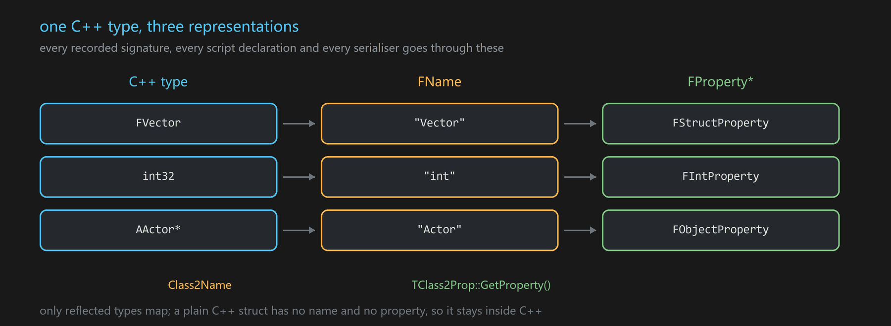

# Class2Name / TClass2Prop

Mapping between a C++ type, the `FName` recorded in the signature table, and the matching `FProperty*`.

**Declared in** `Plugins/GMP/Source/GMP/GMP/GMPClass2Name.h` and `GMPClass2Prop.h`

## Class2Name

Given a type, yields the name used everywhere a type is recorded as text: the [[UGMPMeta]] table, the
`TypeName` on an [[FGMPTypedAddr]], the declarations emitted by codegen.

Every type Blueprint understands is covered, so the name a C++ send records is the same name a Blueprint
node or script declaration uses. That agreement is what makes cross-language validation possible at all.



## TClass2Prop

Goes one step further and yields a `FProperty*` for the type:

```cpp
template<typename T> struct TClass2Prop { static P* GetProperty(); };
```

The property is what you need whenever the other side speaks reflection rather than C++ types —
serialisation, RPC argument encoding, script marshalling. It is the mechanism behind
[[FRpcMessageUtils]]`::Z_PostRPC` turning a parameter pack into a property list.

## When you would use them directly

Both are usable on their own, outside messaging. They are worth knowing about when writing library or
support code: getting from a template parameter to a `FProperty*` by hand is a large amount of boilerplate,
and this is that boilerplate already written.

```cpp
FProperty* Prop = GMP::TClass2Prop<FVector>::GetProperty();
```

## Limits

Only reflected types are mappable. A plain C++ struct that is not a `USTRUCT` has no property and no stable
name, so it cannot cross into Blueprint, script or the wire — it can still be passed between C++ listeners,
where the types are checked by the compiler anyway.

## See also

[[UGMPMeta]] · [[FGMPTypedAddr]] · [[FRpcMessageUtils]] · [[FMessageBody]]
