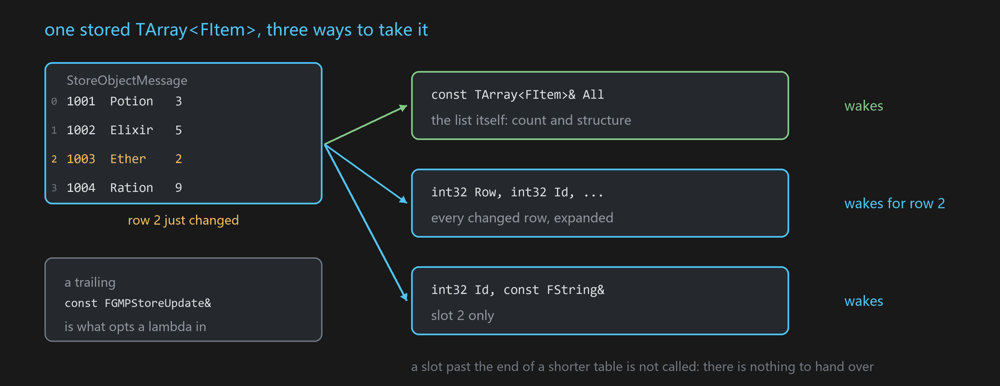
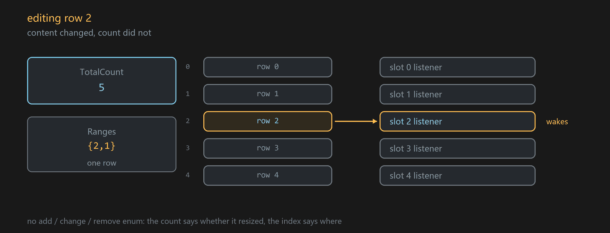
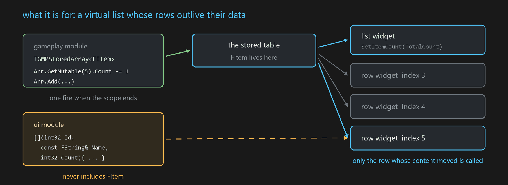

# Collection messages

A stored message whose single parameter is a `TArray` of `USTRUCT` is a **collection**: listeners can take the
whole table, one fixed slot, or every changed row — and a row can be read without depending on the element type.

**Declared in** `Plugins/GMP/Source/GMP/GMP/GMPStoreCollection.h`



Nothing new to learn if you do not want it. `StoreObjectMessage` and `ListenObjectMessage` behave exactly as
before for every other shape; a collection is recognised from the stored parameter, not from a new entry point.

## Storing

```cpp
USTRUCT() struct FItem { GENERATED_BODY() UPROPERTY() int32 Id; UPROPERTY() FString Name; UPROPERTY() int32 Count; };

FGMPHelper::StoreObjectMessage(Obj, MSGKEY("Inv.Items"), MyItems);   // TArray<FItem>, existing API
```

The only new requirement is that the element is a `USTRUCT`. Storing the whole table again is diffed against what
is already there with `UScriptStruct::CompareScriptStruct`, so handing GMP the full array is as precise as editing
it in place — a run of differing elements becomes one span, an unchanged table publishes nothing.

To edit without rebuilding the array, use the writer:

```cpp
{
    TGMPStoredArray<FItem> Arr(Obj, MSGKEY("Inv.Items"));
    Arr.GetMutable(5).Count -= 1;
    Arr.Add(FItem{1002, TEXT("Elixir"), 5});
    Arr.RemoveAt(7);
}   // one fire on destruction, spans merged
```

It is stack-only by design — a heap or member instance would defer or lose the notification. `operator[]` is
const; writing goes through `GetMutable(i)`, because a non-const `operator[]` cannot tell whether the caller
actually wrote anything and would have to mark the row anyway.

## What a listener is told

```cpp
struct FGMPStoreRange { int32 Index; int32 Count; };

struct FGMPStoreUpdate
{
    int32 TotalCount;                          // the table size after the change
    TArrayView<const FGMPStoreRange> Ranges;   // which rows now read differently
    bool  IsFullReload() const;
};
```

There is no add/change/remove enum: the two dimensions carry it. The count says whether the table resized, the
index says where — changing row 3 keeps the count, inserting at 3 raises it, removing at 3 lowers it. A resize
widens `Ranges` to the tail, because every row after the first touched one now holds different content.

## Listening

```cpp
ListenObjectMessage(SigSrc, K,        Listener, Lambda);   // whole table
ListenObjectMessage(SigSrc, K, Index, Listener, Lambda);   // Index >= 0 that slot, < 0 every changed row
```

A lambda ending in `const FGMPStoreUpdate&` opts into the collection; without it the listen is an ordinary
message listen, unchanged. Four shapes:

```cpp
// whole table, strongly typed -- a reference to the stored array, no copy
[](const TArray<FItem>& All, const FGMPStoreUpdate& U){ ... }

// whole table, no dependency on the element type
[](FGMPStoreView View, const FGMPStoreUpdate& U){ ... }

// notification only
[](const FGMPStoreUpdate& U){ ... }

// per row, through the Index overload -- members expand positionally, so no element type is needed
FGMPHelper::ListenObjectMessage(Obj, K, -1, this, [](int32 Row, int32 Id, const FString& Name, int32 Count){ ... });
FGMPHelper::ListenObjectMessage(Obj, K,  5, this, [](int32 Id, const FString& Name, int32 Count){ ... });
```

A stored table is replayed to a listener that arrives late, as with any [[StoreObjectMessage]]. Unlistening is
the existing `UnbindMessage(K, Listener)` family — a collection listener dies with its `UObject` or
[[FSigHandle]] like any other.

### A fixed slot is a position, not an element



`Index >= 0` means *what is displayed at row N*, which is what a virtual list row widget wants:

| | slot 5 |
|---|---|
| row 5 edited | fires |
| row 3 edited | does not fire |
| insert at 3 | fires — the old row 4 moved into position 5 |
| remove at 3 | fires — the old row 6 moved into position 5 |
| insert or remove at 8 | does not fire |
| the table shrank past 5 | **does not fire** — there is nothing to hand over |

The last row is deliberate. A slot listener never has to handle "my position is gone": the whole-table listener
sees `TotalCount` and destroys that row widget, whose destruction unlistens.

### Reading a row without the type

```cpp
struct FGMPStoreView            // borrowed; valid only for the callback
{
    int32 Num() const;
    template<typename F> void VisitRow(int32 Row, F&& Lambda) const;   // (Id, Name, Count)
    template<typename F> void ForEach (F&& Lambda) const;              // (Row, Id, Name, Count)
    template<typename T> const TArray<T>& As() const;                  // when you do have the type
};
```

Members expand by **declaration order of the element struct**, read through reflection, so a UI module can
consume a table defined by a gameplay module without including its header. A lambda may declare only the first
few members.

**Editor-only members are skipped.** A `WITH_EDITORONLY_DATA` member would otherwise sit in the middle of the
sequence in editor and vanish in shipping, and a positional lambda would read a different field per
configuration. Skipping makes the visible sequence the same everywhere.

## What it is for



A virtual list recycles a fixed set of row widgets over a moving table, which is exactly the shape this fits: the
list widget follows `TotalCount`, each row widget follows its own position, and the module that draws the rows
never learns the element type. A row widget stops being called the moment its position is past the end, so it
never has to ask whether it still has data.

The case it is really aimed at is **instances that come and go at run time** — party members, spawned entities,
inventory rows, a scoreboard. The data side edits an array; nobody allocates a per-instance object for the UI to
hold, and nobody has to tear one down.

## Several instances of the same thing

There are now two ways to say "the same key, but a different one of these", and they answer different questions.

| | one key, several **sources** | one key, one table, several **rows** |
|---|---|---|
| how | a different `FSigSource` per instance, or `ExactObjName` | a row index into the stored array |
| fits | instances that are long-lived objects and own their state | instances that appear and disappear, consumed by recycled widgets |
| identity | the object | the position |
| lifetime | the store dies with its source | rows are just array elements |

Nothing is ever pushed at a row: a row subscribes to *its own position*. That is why a row consumer never has to
handle "the thing I was showing is gone" — it holds a slot number, not an entity, and a slot past the end is
simply not called. The whole-table listener is the one that sees `TotalCount` and destroys the widget.

The cost of that choice: **a position is not an identity.** If what you mean is "the head equipment slot, and I
do not care what other slots do", an index cannot express it — inserting anything before it moves it. That case
wants a key field on the element and is a separate piece of work, deliberately not folded into this one.

## What this is not

It is an observable table, not a view model. There is no object per row, no per-field notification, no write-back
through the binding, and no editor that compiles bindings for you. Those all need a typed object on both ends of
the binding, which is the thing the string key exists to avoid — adding them here would buy back the coupling.

Nothing stops a view model from sitting on top: it can be a collection listener internally, and then it is the
one deciding what a field-level change means for it.

## Blueprint

The whole-table form needs nothing new: the tag's parameter is `TArray<FItem>`, and a listen node already gives
an array pin.

For rows, right-click a listen node on a collection tag — a **Collection** section offers *Whole Table* (the
default) or *Row*. Row mode adds an `Index` input and gives `(Row, Item)` outputs; the node titles itself
`ListenMessageRow`. `Index` is an ordinary pin, so a row widget can subscribe to its own row number at run time.
The section only appears for a tag that carries one array of structs.

## Cost

Measured with `-run=GMPUnitTest -Bench` (64 rows, best of three, Development editor):

| | |
|---|---|
| dispatch, whole table, one listener | 56 ns |
| dispatch, 64 slot listeners, one wakes | 253 ns |
| `ForEach` per row, compiled offsets | 0.9 ns |
| `ForEach` per row, reflection | 10 ns |
| *for scale:* an ordinary GMP slot send | ~690 ns |

`ForEach` reads rows at compiled offsets when the arguments a lambda declares line up with the element layout —
same offset, same width, same type for each declared member — and falls back to reflection when they do not.
Correctness never depends on the shortcut; a mismatch (an editor-only member shifting the rest, a missing
`UPROPERTY`, a same-width different type) just takes the slower path. A slot or per-row listener makes that
decision once, on its first fire, and remembers it.

## Limits

- The element must be a `USTRUCT`; members that participate must be `UPROPERTY`.
- A removal in the middle of a table published as a whole reports one wide span, not "one row removed" —
  recognising that needs a sequence diff.
- `FGMPStoreView` is borrowed. Do not store it past the callback.
- Subscribing by name rather than by index is not implemented; the design keeps `TArray` and marks a key field
  with `meta=(GMPKey)` rather than switching to `TMap`, so index and name can coexist.

## See also

[[StoreObjectMessage]] · [[ListenMessage family]] · [[FGMPStructUnion]] · [[FSigSource]]
