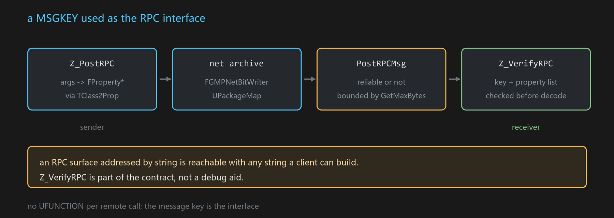

# FRpcMessageUtils

A MSGKEY used as an RPC interface: send a message that happens to cross the wire, instead of declaring a
UFUNCTION per remote call.

**Declared in** `Plugins/GMP/Source/GMP/GMP/GMPRpcUtils.h:17`

```cpp
class GMP_API FRpcMessageUtils
{
    static UPackageMap*      GetPackageMap(APlayerController* PC);
    static const int32       GetMaxBytes();
    static void              PostRPCMsg(APlayerController* PC, const UObject* Sender,
                                        const FString& MessageStr, TArray<uint8>& Buffer,
                                        bool Reliable = true);
    static APlayerController* GetLocalPC(const UObject* Obj);
    static int32             GetPlayerLocalSequence(const APlayerController& PC);

    static bool Z_VerifyRPC(APlayerController* PC, const UObject* Obj,
                            const FMSGKEY& MessageKey, const TArray<FProperty*>& Props);

    template<typename T, typename... TArgs>
    static void Z_PostRPC(bool bReliable, APlayerController* PC, T* Sender,
                          const FMSGKEY& MessageKey, TArgs&... InArgs);
};
```



## How it works

`Z_PostRPC` turns the argument pack into a `FProperty*` list via [[Class2Name]]`/TClass2Prop`, serialises
through [[GMPArchive]]'s net writer, and posts the buffer with `PostRPCMsg`. Because it rides UE's own
network serialisation and `UPackageMap`, object references and replication semantics behave as they
normally do — this is not a parallel transport.

`Reliable` selects the reliable or unreliable channel, as with any UE RPC.

## Verification at the boundary

`Z_VerifyRPC` checks the incoming key and property list against what the endpoint expects.

This is not optional hygiene. An RPC surface addressed **by string** is reachable with any string a client
can construct, so the receiving side has to validate the key and the argument shape before decoding.
Treat the verify step as part of the contract, not a debug aid.

## Size

`GetMaxBytes()` bounds the payload. Exceeding it is a caller-side concern — chunking or moving the data out
of band is up to you.

## See also

[[GMPArchive]] · [[Class2Name]] · [[MSGKEY]]
