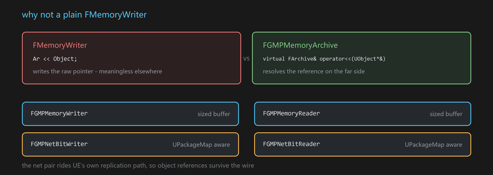

# GMPArchive

The archive types GMP serialises through.

**Declared in** `Plugins/GMP/Source/GMP/GMP/GMPArchive.h`

```cpp
class FGMPMemoryArchive : public FMemoryArchive
{
protected:
    virtual FArchive& operator<<(UObject*& Object) override;
};

class GMP_API FGMPMemoryWriter : public FGMPMemoryArchive { ... };
class GMP_API FGMPMemoryReader : public FGMPMemoryArchive { ... };
class GMP_API FGMPNetBitWriter : public FNetBitWriter     { ... };
class GMP_API FGMPNetBitReader : public FNetBitReader     { ... };
```



## Two pairs

| Pair | For | Object references |
|---|---|---|
| `FGMPMemoryWriter` / `FGMPMemoryReader` | plain memory, sized buffer | via the overridden `operator<<` |
| `FGMPNetBitWriter` / `FGMPNetBitReader` | the network path | `UPackageMap`-aware, so references resolve on the far side |

## The part that matters

`FGMPMemoryArchive` exists to override one thing:

```cpp
virtual FArchive& operator<<(UObject*& Object) override;
```

A default memory archive would serialise the raw pointer value, which is meaningless once it leaves the
process. Overriding it is what makes object references survive — and it is the reason to use these types
rather than a plain `FMemoryWriter`.

`FGMPMemoryWriter` writes its size through a caller-supplied `uint32*`, so the buffer length travels with
the payload.

## Adjacent, but separate

GMP also bridges JSON, Protobuf (upb) and YAML to UStruct reflection, with `FGMPValueOneOf` for dynamic
access to a decoded value that has no static type. These are independent of the messaging core and usable
on their own; they are enabled by their own build switches (`GMP_WITH_UPB`, `GMP_WITH_YAML`,
`GMP_WITH_JSONDOM`).

## See also

[[FGMPStructUnion]] · [[FRpcMessageUtils]] · [[Build switches]]
