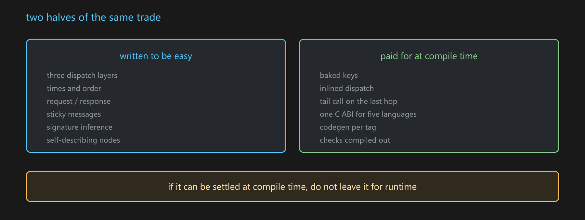

# Why a string key

The design decision everything else follows from.

## What a static signature costs

A native delegate verifies signatures at compile time, so the signature must live in a header both sides
include:

```cpp
DECLARE_MULTICAST_DELEGATE_TwoParams(FOnSomething, Type1, Type2);
```

That header is an edge in the build graph. Three consequences:

1. Every translation unit that includes it rebuilds when it changes.
2. Plugin-shaped projects accumulate these edges faster than anyone tracks them.
3. Blueprint needs a parallel mechanism — Interface plus Dispatcher — wired case by case.

The one that bites is the first. **You can delete a module's logic and the build still needs its header.**


## What GMP substitutes

A string:

```cpp
FGMPHelper::NotifyMessage(MSGKEY("Common.Action"), P1, P2);
FGMPHelper::ListenMessage(MSGKEY("Common.Action"), this, [this](Type1& P1, Type2& P2){ ... });
```

Nothing shared is included. Either side can be deleted and the other still compiles.

## What that costs, and where it is paid back

The compiler no longer checks the call. Four mechanisms take over, all of them earlier or later than C++
compile time rather than at it:

| Mechanism | When it catches you | Page |
|---|---|---|
| Signature recorded on first use, compared afterwards | editor, and at runtime under Editor/Development | [[UGMPMeta]], [[Parameter compatibility]] |
| Blueprint pins generated from the signature | Blueprint compile | [[UK2Neuron]] |
| Codegen'd declarations per script language | as you type, in that language's tooling | [[Transparent rewrite]] |
| Source location recorded per call site | when you need to find who sent it | [[Jump tracing]] |



The honest summary: **you trade a compile error for an editor-time error**, and you get module removability
in exchange. If your project never removes or reorders modules, the trade is worth less to you.

## What is deliberately not solved

- Nothing prevents a typo in a tag that was never used before — it registers as a new tag. The tag tree in
  the editor is the mitigation.
- Nothing checks a Shipping-only code path that no editor run ever exercised, because the check is compiled
  out there.

## See also

[[MSGKEY]] · [[Parameter compatibility]] · [[Signature inference]] · [[Dispatch layers]]
